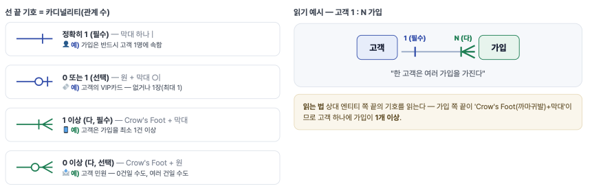
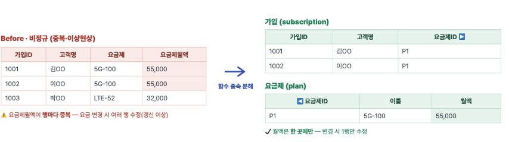

# 스마트 데이터 이해 및 활용 - DB 개요 & 데이터 모델링

## 사전 내용
데이터
정형 - 행/열 구조, RDBMS에 저장
비정형 - 텍스트, 음성, 이미지
통합분석 - 정형 + 비정형을 함께 활용하는 흐름

ML/DL의 한계
1. 데이터 품질, 양 의준 - 데이터 이외의 정보는 모름
2. 설명가능성 부족 - 어떻게 내부적으로 처리되어 결론이 도출되는지 모름
3. 최신성의 한계 - 학습 시점 이후의 정보를 모름

생성형 AI와 DB의 역할
- LLM + RAG를 통한 최신 자료 보강
- 데이터베이스, Vector DB를 통해 지식 공급

## 데이터, 데이터베이스, DBMS
데이터: 현실의 사실, 값 그 자체
DATABASE: 목적에 맞게 통합, 저장된 데이터의 집합
DBMS: 관리 시스템, 데이터베이스를 정의,조작,제어하는 소프트웨어

데이터베이스 구조
- 스키마: DB의 청사진
- 컬럼
- 행
- 키: 행 식별 테이블 연결 PK로 한 건을 유일 식별, FK로 다른 테이블과 연결
- 인덱스: 특정 컬럼을 빠르게 찾도록 만든 색인

## 데이터 흐름
1. 데이터 생성
2. OLTP, RDBMS 를 통해 데이터 처리
3. OLAP, 대량 집계, 분석을 위한 저장소(DW, Data Lake, Data Mart)

데이터 -> 운영계에 쌓임 -> 분석계에 모아 분석, AI 학습

## DBMS

|관점|파일시스템|DBMS|
|----|----|----|
|데이터 독립성|프로그램에 종속-구조 변경시 코드 수정|논리,물리 독립성 보장|
|데이터 중복|파일마다 중복 저장 -> 불일치 발생 확률 증가|통합 관리로 중복 최소화|
|무결성|애플리케이션이 직접 검증|제약조건으로 DBMS가 보장|
|동시성 및 복구|제어 어려움, 장애 시 수동 복구|트랜잭션, 로그 기반 자동 복구|

### 3대 핵심 기능
1. 데이터 독립성: 저장 구조가 바뀌어도 응용 프로그램은 영향 받지 않음
2. 무결성 보장: 제약조건으로 잘못된 데이터의 저장을 DBMS가 원천 차단
3. 동시성, 회복: 여러 사용자의 동시 접근을 제어, 장애 시 일관된 상태로 복구

### SQL 질의에서 RDBMS 엔진까지
질의 -> 파서 -> 옵티마이저 -> 실행기 -> 저장 엔진

파서: SQL 문장을 검증하고 내부 구조(트리)로 변환
옵티마이저: 같은 결과를 내는 여러 방법 중 최소 비용 실행계획 선택
실행기: 선택된 실행계획을 단계별로 수행해 결과 집합을 만듬
저장 엔진: 디스트와 버퍼 사이의 데이터 입출력을 담당

## SQL
DDL (Data Definition Language · 정의어) — 표를 만들고 바꾸는 설계
DML (Data Manipulation Language · 조작어) — 데이터를 넣고 빼고 바꾸는 내용
DCL (Data Control Language · 제어어) — 권한을 주고 회수하는 보안
TCL (Transaction Control Language · 트랜잭션 제어어) — 작업을 확정/취소하는 거래

분류|역할|대표명령어
DDL(정의)|구조(스키마)를 정의, 변경|CREATE,ALTER,DROP,TRUNCATE
DML(조작)|데이터를 조회,삽입,수정,삭제|SELECT, INSERT, UPDATE, DELETE
DCL(제어)|권한을 부여, 회수|GRANT, REVOKE
TCL(트랜젝션)|트랜잭션을 확정,취소|COMMIT, ROLLBACK, SAVEPOINT

## 실습 도메인 - 이동통신 데이터 모델


## 데이터 모델링 3단계
개념 모델 -> [구체화] -> 논리 모델 -> [구현] -> 물리 모델
개념 모델: 업무 관점에서 무엇을 관리할 지 -> 개념 ERD
논리 모델: 정규화, 키, 속성 정의로 구체화. -> 논리 ERD, 정규화
물리 모델: DBMS에 맞춰 테이블,자료형,인덱스로 구현 -> 테이블, DDL

## ERD


엔티티들이 어떻게 연결되는지 그린 관계 지도

### 작성 절차
1. 요구사항 분석: (예)고객은 요금제에 가입하고 매월 사용량이 쌓인다. -> 관리 대상, 규칙을 뽑는다.
2. 엔티티 도출: 문장의 명사 (예) 고객, 요금제, 가입, 가입내역 -> 4개 엔티티 후보
3. 관계 정의: 엔티티 사이의 동사 (예) 고객 1 ---N 가입, 요금제 1 ---- N 가입(한 고객이 여러 번 가입)
4. 속성, 식별자 정의: 각 엔티티의 속성을 채우고, PK,FK 지정
5. 검증, 정규화: 중복, 이상현상을 정규화로 점검하고 다듬는다. (예) 가입에 '요금제명'이 중복이면 3NF 위반 -> 요금제 테이블로 분리.

## 식별자

1. 주식별자(PrimaryKey): 후보키 중 대표로 선택한 식별자
2. 후보키(Candidate): PK가 될 자격이 있는 모든 키
3. 대리키(Surrogate): 시스템이 부여한 일련번호 PK로 선호됨
4. 외래식별자(ForeignKey): 다른 엔티티의 PK를 참조해 관계를 구현

## 속성

값의 성격에 따라
- 기본 속성: 직접 입력 원본 값
- 설계 속성: 관리를 위해 부여한 코드, 구분값
- 파생 속성: 다른 값에서 계산된 산출값

값의 개수, 구조에 따라
- 단일값 속성: 한 칸에 값 하나
- 복합 속성: 여러 항목이 묶임

## 키와 무결성 제약조건

제약조건|보장내용|무결성 종류
PK|유일 + NOT NULL|개체 무결성
FK|참조 대상이 반드시 존재|참조 무결성
UNIQUE|값의 중복 금지|도메인 무결성
NOT NULL|빈 값 금지|도메인 무결성
CHECK|조건식 만족|도메인 무결성

## 데이터 정규화
정규화: 하나의 사실을 한 곳에만 저장하도록 함수 종속 기준으로 표를 나누는 작업

**이상현상**
- 갱신 이상
- 삽입 이상
- 삭제 이상

**정규형 목록**
1NF: 원자값 - 한 칸에 값 하나
2NF: 부분 함수 종속 제거 (복합키 일부 의존 분리)
3NF: 이행 함수 종속 제거 (비키 속성 간 의존 분리)

**함수 종속 제거**


### 반정규화
의도적으로 자주 함께 보는 값을 `복사`해 조인을 줄임
원본 변경 시 복사본 갱신 책임 발생

원칙: 먼저 정규화로 설계 -> 성능 측정 -> 병목이 확인된 곳만 선택적으로

무엇을 측정하나요?
1. 응답시간 지연
2. 실행계획
3. 호출빈도
4. 더 싼 대안 먼저
5. 유지 비용

---

## SQL로 구현하고 조회하기

### 데이터 타입

- 숫자형: INT / NUMERIC / REAL, DOUBLE / BIGSERIAL, IDENTITY
- 문자형: CHAR(고정) / VARCHAR(가변) / TEXT
- 날짜,시간형: DATE / TIMESTAMP / TIEMSTAMPTZ / INTERVAL
- 논리형
- 이진, 기타
- 반정형

### 무결성
- 개체 무결성: 모든 행은 유일하게 식별한다.
- 참조 무결성: FK는 반드시 존재하는 부모를 가리킨다.
- 도메인 무결성: 값이 허용 범위, 형식을 만족 시킨다.

### PRIMARY KEY, UNIQUE, NOT NULL

복합 키·여러 컴럼 UNIQUE는 테이블 레벨로 선언: PRIMARY KEY (cust_id, benefit_id)

### 외래키와 참조 무결성
```sql
FK 선언
CREATE TABLE subscription (
    sub_id BIGSERIAL PRIMARY KEY,
    cust_id BIGINT NOT NULL,
    FOREIGN KEY (cust_id)
        REFERENCES customer (cust_id)
        ON DELETE RESTRICT
);
```
RESTRICT: 자식 있으면 삭제 거부
CASCADE: 자식도 함께 삭제
SET NULL: 자식의 FK를 NULL로

### DDL - 구조를 정의하는 언어
- CREATE: 객체 생성
- ALTER: 구조 변경
- DROP: 객체 삭제
- TRUNCATE: 전체 비우기

--> DDL은 데이터가 아닌 데이터의 구조를 다룬다. -- 실행 결과는 시스템 카탈로그(메타데이터)에 남는다.

**CREATE(생성)**

```sql
-- subscription 테이블 — 가입(구독): 고객이 어떤 요금제에 언제부터 가입했는지
CREATE TABLE IF NOT EXISTS subscription (
    -- ① 컬럼 레벨: 컬럼 옆에 바로
    sub_id BIGSERIAL PRIMARY KEY,
    cust_id BIGINT NOT NULL REFERENCES customer,
    plan_id BIGINT NOT NULL REFERENCES plan,
    start_dt DATE NOT NULL DEFAULT CURRENT_DATE,
    monthly_fee NUMERIC(10,2),
    status VARCHAR(10) DEFAULT '활성',
    -- ② 테이블 레벨: 컬럼 다음, 아래쪽에 모아서
    CHECK (monthly_fee>=0),
    CHECK (status IN ('활성','정지','해지'))
);
```

1. 컬럼 레벨
2. 테이블 레벨
테이블을 만드는 명령, 규칙

ALTER(구조변경)

```sql
-- 컬럼 추가
ALTER TABLE subscription
    ADD COLUMN term_months INT;
-- 타입 변경
ALTER TABLE subscription
    ALTER COLUMN status TYPE VARCHAR(12);
-- 제약 추가
ALTER TABLE subscription
    ADD CONSTRAINT chk_term
    CHECK (term_months >= 0);
```

이미 있는 테이블에서 컬럼을 추가하면, 기존의 데이터 행에는 어떤 값이 들어갈까?
 ㄴ 기본값을 지정하지 않을 경우 NULL, NOT NULL 조건이 걸려있다면 오류발생

큰 테이블 변경은 잠금 혹은 다운타임 유발 가능
 ㄴ nullable로 추가 -> 값 채움 -> 제약 부여 순으로 단계화

**변경 전 확인** — 바뀔 규칙을 위반하는 행을 COUNT로 먼저 센다
· NOT NULL 추가 전 — NULL 행이 있나
SELECT COUNT(*) … WHERE term_months IS NULL;
· CHECK 추가 전 — 조건 위반 행이 있나
SELECT COUNT(*) … WHERE NOT (term_months >= 0);
· 타입 축소 전 — 값이 새 길이에 다 들어가나
SELECT COUNT(*) … WHERE length(status) > 10;
· 의존성 — 이 컬럼을 참조하는 FK·인덱스·뷰가 있나 (함께 깨질 수 있음)

DROP, TRUNCATE

DROP - 테이블 구조 + 데이터 전체를 삭제 --> 그냥 데이터를 통째로 삭제(삭제)
TRUNCATE - 모든 행,열 구조는 유지하고 내부의 값만 삭제 --> 테이블 구조만 남기고 값 삭제(리셋)
-- DML의 DELETE - 조건에 맞는 일부 행만 삭제 --> 데이터 내부의 어떠한 행 하나만 골라 삭제

### DML - 데이터를 정의하는 언어
- INSERT: 새 행 추가
- UPDATE: 기존 행 수정
- DELETE: 조건부 행 삭제
- SELECT: 조회

INSERT(데이터 추가)
```sql
-- 기본형 · 다중행 · UPSERT
-- 컬럼 명시 (권장)
INSERT INTO customer (cust_id, name, phone)
VALUES (1, '홍길동', '010-1111-2222');
-- 여러 행 한 번에
INSERT INTO plan (plan_id, plan_name, fee)
VALUES (10,'5G 프리미엄',89000),
(11,'LTE 표준',43000);
-- 중복 시 무시 (UPSERT)
INSERT INTO ... ON CONFLICT DO NOTHING;
```

UPDATE, DELETE (수정과 삭제)
```sql
-- UPDATE
UPDATE subscription
    SET status = '정지',
    monthly_fee = 0
    WHERE sub_id = 1001;
-- DELETE
DELETE FROM subscription
    WHERE status = '해지'
    AND start_dt < '2020-01-01';
```

Where 조건절이 있는게 좋다. 만약 없다면 왜 없는지 한 번 생각해 볼 것!

안전 습관
1. 같은 Where로 Select해 대상 확인
2. 트랜잭션으로 감싸 롤백 여지 확보
3. 그다음 업데이트/삭제 실행

SELECT(조회)
```sql
-- 기본 형태
SELECT name, monthly_fee AS fee
FROM subscription
WHERE status = '활성'
ORDER BY fee DESC
LIMIT 10;
```

각 절은 하나의 질문

작성 순서(우리가 쓰는 순서)
Select -> From -> Where -> Group by -> Having -> Order by -> Limit

실행 순서(DBMS가 처리하는 순서)
From -> Where -> Group by -> Having -> Select -> Order by -> Limit

```text
1. FROM        : 조인할 첫 번째 테이블(기준)을 지정
2. ON          : 조인 조건에 맞는지 확인
3. JOIN        : 조건을 만족하는(혹은 OUTER 조건에 따른) 대상 테이블을 조인하여 하나의 가상 테이블 생성
4. WHERE       : 조인 결과로 만들어진 테이블에서 행 단위 필터링
5. GROUP BY    : 데이터를 특정 컬럼 기준으로 그룹화
6. HAVING      : 그룹화된 결과에 대한 필터링
7. SELECT      : 필요한 컬럼만 선택 및 계산 (별칭 부여)
8. DISTINCT    : 중복 행 제거 (사용 시)
9. ORDER BY    : 최종 결과 정렬
10. LIMIT      : 출력할 행의 개수 제한
```

순서가 다르기 때문에, 별칭을 지정해도 Where에서는 알 수 없음. 그러므로 열 이름을 그대로 작성

```sql
ORDER BY monthly_fee DESC, name ASC
-- 11~20위 (2페이지)
OFFSET 10 LIMIT 10;
```

ORDER BY [DESC/ASC] - 오름차순, 내림차순 정렬
LIMIT (n) - n개만 가져오기
OFFSET (n) - n개 건너뛰기 (페이징)

GROUP BY (col_name) - 가져온 데이터를 그룹화
HAVING (cond) - 그룹화된 결과를 다시 필터링 (단독 사용 시 테이블 전체를 하나의 그룹으로 처리)

WHERE (cond) - 데이터를 조건에 맞게 필터링

BETWEEN (a) and (b) - a이상 b 이하 // 주의사항: 날짜,시간에 사용 시 마지막 날 하루가 누락됨 --> `x >= (day) AND x < 다음날`

IN (...) - 목록 중 하나와 일치 <> OR의 간결한 대체.

LIKE - 문자 패턴 매칭
- '010%': 010으로 시작
- '%프리미엄%': 포함
- '____': 정확히 4글자(_ = 1글자)
- ILIKE '%LTE%': 대소문자 무시

앞에 %가 오는 '%xxx' 패턴은 인덱스를 타지 못해 느려짐