## JOIN
- 나뉜 테이블을 다시 합치기

정규화로 나눈 테이블을 FK-PK 관계에 따라 다시 연결하는 연산. 연산 조건은 ON절에 적는다.
--> ON을 빠뜨리면 카티션 곱 발생(모든 행 조합, 행 수 폭증)

조인 종류
종류|한 줄 정의|짝 없는 행 처리
INNER|양쪽 ON이 일치하는 행만|제외-양쪽 모두 있어야함
LEFT|왼쪽 전체 + 오른쪽 짝 없으면 NULL|왼쪽 보존
RIGHT|오른쪽 전체 + 왼쪽 짝 없으면 NULL|오른쪽 보존
FULL|양쪽 전체, 짝 없으면 NULL|양쪽 보존
SELF|한 테이블을 자기 자신과 조인|조건에 따름
CROSS|두 테이블의 모든 조합(카티션 곱)|조건 없음

--> JOIN 앞에 종류를 생략하면 기본으로 INNER
--> ON을 생략하면 기본으로 CROSS

### 왜 INNER와 LEFT를 많이 쓸까?
RIGHT보다 LEFT를 많이 쓰는 이유
1. 읽기나 작성 흐름이 사람이 읽고 쓰는 사고 순서와 일치.
- 전부 남길 **기준 테이블**을 FROM의 맨 앞에 두고 LEFT를 붙임.
2. RIGHT는 LEFT로 대체 가능
```sql
A RIGHT JOIN B
≡ B LEFT JOIN A
```
3. 가독성, 팀 표준
- 여러 표를 연쇄 JOIN할 때 기준이 앞에 있어야 추적이 쉬움.

INNER를 많이 쓰는 이유
- 양쪽에 실제로 짝이 있는 데이터만 본다. 대부분의 조회가 여기에 해당.

### INNER JOIN
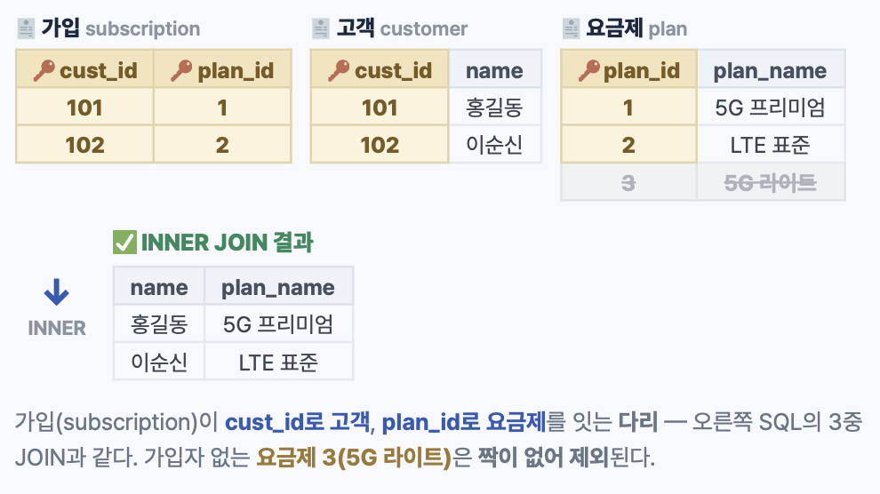
```sql
SELECT c.name, p.plan_name
FROM subscription s
JOIN customer c ON s.cust_id=c.cust_id
JOIN plan p ON s.plan_id=p.plan_id;
```
--> 가입 표 + 고객 표 + 요금제 표 -> 홍길동이 5G 프리미엄에 가입

### OUTER JOIN (LEFT, RIGHT, FULL)
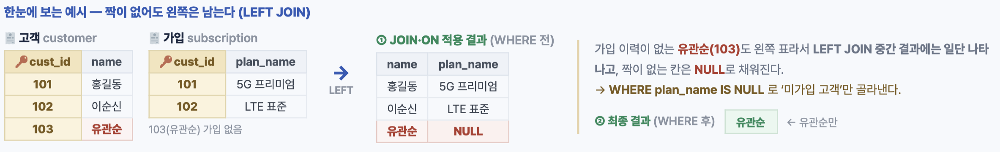
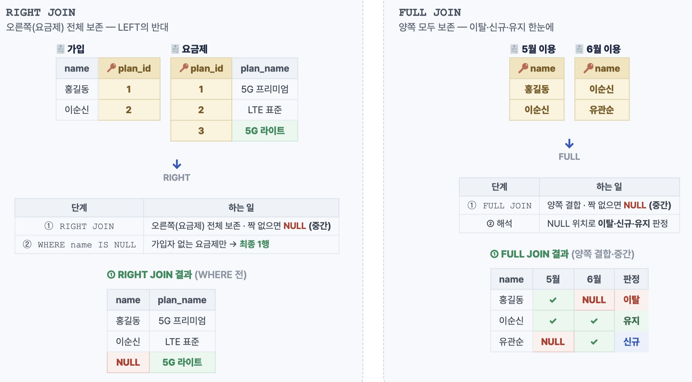
```sql
SELECT c.name
FROM customer c
LEFT JOIN subscription s ON c.cust_id=s.cust_id
WHERE s.sub_id IS NULL; -- 짝 없는 행
```

### SELF, CROSS JOIN
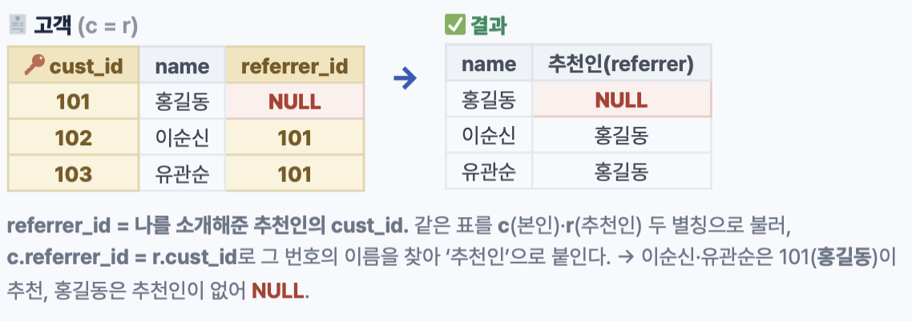
```sql
-- 추천인 이름
SELECT c.name, r.name AS referrer
FROM customer c
LEFT JOIN customer r
ON c.referrer_id = r.cust_id;
```

CROSS: 의도한 경우만 사용
```sql
-- 요금제 × 12개월 매트릭스
SELECT p.plan_name, m.mon
FROM plan p
CROSS JOIN months m;
-- 행 수 = 요금제수 × 12
```

### JOIN을 집합으로 표현
INNER|교집합
LEFT|A전체
FULL|합집합
LEFT + IS NULL|차집합

### 논리적 JOIN과 물리적 알고리즘
논리적 JOIN: 사람은 무엇을 결과로 합칠지 정의만 함.

물리적 알고리즘: 실제 내부에서는 실제 결합방식을 엔진(옵티마이저)가 자동 선택함(통계).
- Nested Loop: 한 명씩 대조
- Hash: 해시표 만들어 대조
- Sort-Merge: 정렬 후 훑기

Nested Loop Join
- 바깥 테이블의 각 행마다 안쪽 테이블을 탐색해 짝을 찾음.
- 안쪽 조인 컬럼에 인덱스가 있으면 빠름.
- 두 테이블 모두 크고 인덱스가 없으면 불리함.
```
-- O(N^2)
for 행 in 바깥테이블:
for 짝 in 안쪽테이블(인덱스):
if 조인조건: 결과 출력
```

Hash Join
- 작은 쪽 해시를 만들어서 큰 쪽을 탐색
- 대용량 등가(=)조인으로 인덱스 없어도 빠름, 조회 O(1)
- 그러나 오직 등가조건에서만 사용해야함. 메모리 초과 시(디스크 스필) 느려짐
- Build: 작은 테이블을 조인 칼럼 기준 해시 테이블로
  Probe: 큰 테이블을 한 번 훑으며 해시로 즉시 매칭

Sort-Merge Join
- Sort: 두 테이블을 조인 컬럼 기준으로 각각 정렬
- Merge: 정렬된 양쪽을 동시에 훑으며 병합 매칭
- Hash와 달리 범위 조인도 가능
- 정렬되지 않은 대용량의 데이터는 정렬 비용이 커짐.

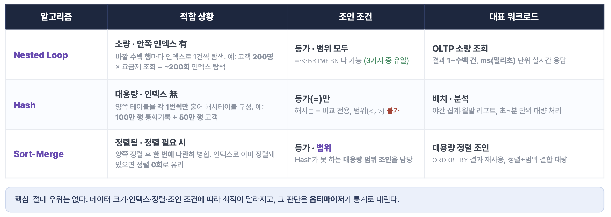

### 옵티마이저가 조인 알고리즘을 고르는 방식
1. 무엇을 보고 판단?
- 조인 조건: 등가(=) or 범위(<,>,BETWEEN)
- 예상 행 수: 카디널리티, 선택도 (통계 기반)
- 인덱스 유무: 조인 컬럼에 인덱스가 있나
- 정렬 상태
- 가용 메모리

2. 선택 흐름
- 범위 조인일 때: Hash를 제외한 나머지 후보
- 등가(=) 조인 일 때: 3가지 후보 중 비용으로 결정

### 카디널리티와 선택도
**카디널리티**
- 조건을 통과할 것으로 예상되는 행의 절대 개수.
- 적으면 Nested Loop, 많으면 Hash 쪽으로 기운다.

**선택도**
- 전체 중 조건을 통과하는 비율 = 카디널리티 / 전체 행 수.
- 낮을수록 많이 걸러져 인덱스 조회가 유리

선택도는 몇 %가 남냐(비율), 카디널리티는 실제 몇 건 남나(개수)

### 좋은 조인 순서 공식
1. 많이 걸러지는 조건(낮은 선택도)부터 처리해 중간 결과를 작게
2. 작아진 집합에 나머지 테이블을 붙인다.

### EXPLAIN COMMAND
쿼리 앞에 EXPLAIN을 붙이면 실행계획이 나오고, 그 조인 노드 이름이 곧 옵티마이저가 고른 물리 조인이다.

```
EXPLAIN
SELECT * FROM 가입 g
JOIN 고객 c ON g.cust_id = c.id;

Hash Join (cost=1.09..2.23 rows=5)
Hash Cond: (g.cust_id = c.id)
    -> Seq Scan on 가입 g
    -> Hash
    -> Seq Scan on 고객 c
```

EXPLAIN vs EXPLAIN ANALYZE
EXPLAIN: 추정 계획만 (실행 X)
ANALYZE: 실제 실행 -> 실제 시간,행 수.


## 서브쿼리
쿼리 안의 쿼리

SELECT 절 -> 스칼라 서브쿼리
```
SELECT name, (SELECT COUNT(*) FROM subscription s
WHERE s.cust_id=c.cust_id) AS 가입수 FROM customer c
```

FROM 절 -> 인라인 뷰
```
FROM (SELECT plan_id, COUNT(*) c
FROM subscription GROUP BY plan_id) t
```

WHERE 절 -> 조건 서브쿼리
```
WHERE cust_id IN
(SELECT cust_id FROM subscription)
```

상관 여부

비상관(독립): 바깥과 무관하게 한 번 실행
상관: 바깥 행마다 값을 참조해 반복 실행

### 스칼라 서브쿼리
- 1행 1열(단일 값)을 반환해야 함.
- 2행 이상 반환 시 오류

### 인라인 뷰
- 임시 테이블 표를 만들어서 사용하는 것과 같음.
- 인라인 뷰 대신, WITH 절(CTE)를 사용하는 것을 추천(가독성, 재사용성 더 좋음)

### 상관 서브쿼리
```sql
-- 요금제 내 평균보다 비싼 가입
-- 바깥 쿼리 (한 행씩 스캔)
SELECT s.sub_id, s.monthly_fee
FROM subscription s
WHERE s.monthly_fee > (
    -- 상관 서브쿼리 (행마다 재실행)
    SELECT AVG(monthly_fee)
    FROM subscription x
    WHERE x.plan_id = s.plan_id -- ← 바깥 s 참조=상관
);
```
1. 바깥 쿼리 (subscription s를 한 행씩 스캔)
2. 상관 서브쿼리(행마다 재실행)
3. 비교 선택
4. 반복

--> 옵티마이저는 종종 상관 서브쿼리를 조인으로 변환(Unnesting)해 성능을 올림.

### EXISTS, IN - 존재로 거르기

Todo.

### ANY, ALL - 다중 값 비교

식|의미|동등
X > ANY|하나만 크면 참|X > MIN
X > ALL|모든 값보다 커야 함|X > MAX
X = ANY|하나와 같으면 참|X IN (...)

### 서브쿼리 vs 조인
서브쿼리 유리
- 존재 여부만 확인
- 단계적 가공
- 한 값 비교
- 중복 없이 필터만 하고 싶을 때

조인 유리
- 양쪽 테이블의 컬럼을 함께 출력
- 다대다, 다중 차원 결합
- 집계와 결합을 한 번에
- 1:N에서 행이 늘어남에 주의

### Unnesting

```
작성 (상관 서브쿼리)
-- 고객을 한 행씩 스캔
SELECT c.name
FROM customer c
WHERE EXISTS(
SELECT 1 FROM subscription s -- WHERE s.cust_id=c.cust_id); -- → N회
고객마다 재실행
```
- 상관 서브쿼리 그대로 — 반복 실행
- C001 ➜ 서브쿼리 실행 (1)
- C002 ➜ 서브쿼리 실행 (2)
- C003 ➜ 서브쿼리 실행 (3)
- = 고객마다 subscription을 매번 다시 탐색 → N회


```
실행 (세미 조인)
SELECT DISTINCT c.name
FROM customer c
SEMI JOIN subscription s -- ① 1회만 훑어 목록화
ON s.cust_id=c.cust_id; -
```

세미 조인으로 변환 — 1회 처리
1 subscription을 한 번만 훑어 ‘가입 있는 고객 목록’을 만든다 → {C001, C003}
2 customer 각 행이 그 목록에 있나 즉시 조회 (subscription 재탐색 ✗)
= subscription을 딱 1번만 읽음

### 상관 서브쿼리의 비용과 완화
비용 구조
바깥 N행 -> 서브쿼리 최대 N회 실행. 바깥이 클수록 비용이 선형 증가.

완화 방법
1. 표준 형태로 작성해 Unnesting 유도
2. 서브쿼리 조인 컬럼에 인덱스 제공
3. 집계 후 조인(CTE, 인라인 뷰)으로 재작성

서브쿼리 최적화 리스트
권장
- 표준적 EXISTS/IN 작성(Unnesting)
- 서브쿼리 조인 컬럼에 인덱스
- 단계 가공은 CTE로 가독성 확보
- 결측 처리는 NOT EXISTS

피하기
- SELECT 절의 무거운 상관 스칼라 반복
- NOT IN + NULL 가능 목록
- 불필요하게 깊은 중첩
- 측정 없는 추측성 재작성

```sql
SELECT c.name,
    (SELECT COUNT(*) FROM subscription s
    WHERE s.cust_id=c.cust_id) cnt
FROM customer c;
```
- 행마다 서브쿼리 실행 -> 고객 N명: COUNT N회

```sql
SELECT c.name, x.cnt
FROM customer c
LEFT JOIN (SELECT cust_id, COUNT(*) cnt
    FROM subscription GROUP BY cust_id) x
    ON x.cust_id=c.cust_id;
```
- 한 번 집계 후 조인 1회

## 뷰 - 이름 붙인 가상 테이블

여러 표을 하나로 합친 테이블
뷰는 데이터를 저장하지 않는다. 부를 때마다 정의 쿼리가 다시 실행된다.
-- 어디에 사용? 협력사에 데이터를 숨기고 필요한 정보만 제공할 때

CREATE VIEW v_active_sub AS :: 이름 붙이기

SELECT c.name, p.plan_name, p.monthly_fee :: 무엇을 볼 것인가 = 보안 필터

FROM subscription s
JOIN customer c ON ... :: 어디서 가져오나 = 복잡성 은닉
JOIN plan p ON ...

WHERE s.status='활성'; :: 어떤 행을 = 일관된 기준

### Materialized View - 결과를 저장하는 뷰
조회 속도 - 매우 빠름
최신성 - Refresh 전까지 과거
적합 용도 - 무거운 집계,리포트

```sql
CREATE MATERIALIZED VIEW mv_daily_signup AS
    SELECT signup_date, count(*) AS cnt
    FROM subscription GROUP BY signup_date; -- 미리 집계·저장

REFRESH MATERIALIZED VIEW mv_daily_signup; -- 원본 반영(재계산)
```

## CTE(Common Table Expression)
```sql
월별 사용량을 CTE로 분리
-- ① 이름 붙인 임시표 정의
WITH monthly AS (
    SELECT sub_id,
    date_trunc('month', use_dt) AS ym,
    sum(data_mb) AS mb
    FROM usage_log
    GROUP BY 1, 2 -- 1,2 = 앞 SELECT의 1·2번째 컬럼
    (sub_id, ym)
)
-- ② 그 임시표로 메인 쿼리
SELECT * FROM monthly
WHERE mb > 10000
ORDER BY mb DESC;
```
- 가독성(단계 분해), 재사용, 구조화등의 장점이 있음.
- 쿼리 안의 1회성 표현

**재귀CTE**
```sql
조직도 상하위 펼치기
WITH RECURSIVE org AS (
    -- ① 앵커: 시작 행(최상위)
    SELECT id, name, parent_id, 1 AS lvl
    FROM dept WHERE parent_id IS NULL
    UNION ALL -- 결과를 계속 쌓음
    -- ② 재귀: 자식으로 한 단계씩
    SELECT d.id, d.name, d.parent_id, o.lvl+1
    FROM dept d JOIN org o ON d.parent_id = o.id
) -- 자식 없으면 자동 종료
SELECT * FROM org ORDER BY lvl;
```
앵커 - 재귀의 출발 행(부모가 없는 최상위)
용도 - 조직도, 카테고리 트리, BOM, 경로 탐색

## 집합 연산
UNION - 합집합, 두 결과를 합침(중복 제거)
INTERSECT - 교집합, 양쪽에 모두 있는 행
EXCEPT - 첫 결과에만 있는 행

집합 연산은 세로 결합, 컬럼 개수, 타입 일치 필요

```sql
SELECT id FROM may_user
UNION
SELECT id FROM jun_user;

SELECT id FROM may_user
INTERSECT
SELECT id FROM jun_user;

SELECT id FROM may_user
EXCEPT
SELECT id FROM jun_user;
```

**UNION vs UNION ALL**
UNION: 합친 뒤 중복 제거 -> 내부 정렬 비용 높음, 고유 목록이 꼭 필요한 경우만 사용
UNION ALL: 중복 없이 그냥 이어붙임 -> 훨씬 빠름, 중복 없거나 허용되면 기본

## 집계 & 윈도우 함수

**함수와 NULL 처리**
함수|NULL
COUNT(*)|포함
COUNT(col)|제외
COUNT(DISTINCT)|중복,NULL제외
SUM,AVG|제외 계산
MAX,MIN|제외

### FILTER절

// FILTER절(SQL:2003)
```sql
SELECT COUNT(*) AS 전체,
    COUNT(*) FILTER (WHERE tier='VIP')
    AS vip
FROM subscription;
```

// CASE 방식(호환)
```sql
SELECT COUNT(*) AS 전체,
    COUNT(CASE WHEN tier='VIP'
    THEN 1 END) AS vip
FROM subscription;
```

- 한 쿼리에서 전체 수와 조건에 맞는 수를 나란히 세고 싶을 때 사용.

### 다중 그룹핑

```sql
SELECT plan_id,
    DATE_TRUNC('month', start_dt) mon,
    COUNT(*) cnt
FROM subscription
GROUP BY plan_id , mon ;
```

- SELECT 컬럼은 GROUP BY에 넣은 그룹 키이거나 집계함수로 감싼 것만 아용할 수 있음.

### HAVING vs WHERE

WHERE - 그룹화 전, 개별행. 집계 불가
HAVING - 그룹화 후, 집계 가능, 묶은 그룹의 집계값으로 판단

```sql
SELECT plan_id, COUNT(*) cnt
    FROM subscription
    WHERE status='활성'
    -- 행 먼저 축소
    GROUP BY plan_id
    HAVING COUNT(*) >= 100; -- 그룹 필터
```

### ROLLUP
- 소계와 총계 자동 생성
```sql
-- ROLLUP
SELECT plan_id, mon,
    SUM(amount)
FROM billing
GROUP BY ROLLUP(plan_id, mon);
```

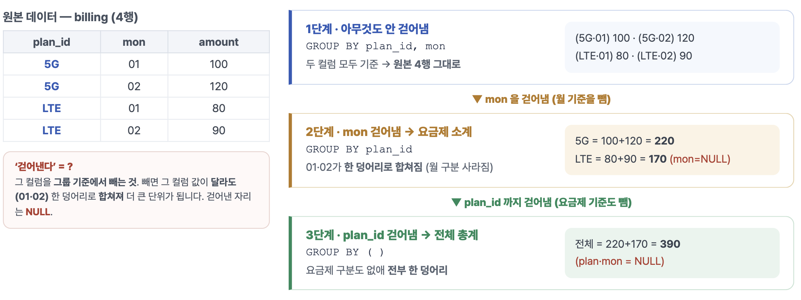

### CUBE, GROUPING SETS
CUBE
- 모든 조합
```sql
SELECT plan, region, SUM(amt)
FROM billing
GROUP BY CUBE(plan, region);
```

GROUPING SETS
- 원하는 조합만 직접 지정

```sql
SELECT plan_id, region, SUM(amount)
FROM billing
GROUP BY GROUPING SETS (
    (plan_id), -- 요금제 소계
    (region), -- 지역 소계
    () -- 전체 총계
);
```

### 그룹핑의 한계

합계 행 라벨링 3단계
1. ROLLUP·CUBE가 소계·총계 행을 추가 → 접힌 컬럼 자리는 NULL
2. GROUPING(plan_id)이 판별 → NULL(소계·총계)이면 1, 실제 값이면
0
3. CASE WHEN …=1 THEN '전체' → 1이면 ‘전체’, 0이면 원래 값 출력

집계의 한계 - 개별이 사라지는 과정
1. 개별 고객 3건 — C1·5G·68,000 / C2·5G·42,000 / C3·LTE·39,000
2. GROUP BY plan — 같은 요금제끼리 버킷에: 5G[C1·C2] · LTE[C3]
3. AVG 계산 → 요금제당 1행: 5G 55,000 · LTE 39,000
--> 이 과정에서 C1·C2의 개별값(68,000·42,000)은 사라집니다. — 그룹의 평균만 남음
**개별 행을 유지하며 집계하고 싶다? --> 윈도우 함수**

### 윈도우 함수
- 이름이 아니라 쓰는 방식으로 정해짐. SUM, AVG, RANK 같은 함수 뒤에 OVER 를 붙이면 행을 압축하지 말고 WINDOW 안에서 계산해라
- 윈도우 함수는 행이 사라지지 않는다.
- GROUP BY는 여러 행을 한 줄로 압축하지만, 윈도우는 행을 그대로 구도 옆 칸에 집계, 순위를 더함.

**OVER, PARTITION BY**

```sql
SELECT sub_id, plan_id, monthly_fee,
    AVG(monthly_fee) OVER (
        PARTITION BY plan_id
    ) AS plan_avg
FROM subscription
```

1. PARTITION BY - 창을 나눈다. 값이 바뀌면 계산이 리셋
2. ORDER BY(선택) - 창 안의 순서, 누적/순위/이전값 계산의 기준
3. 프레임(ROWS/RANGE BETWEEN) - 창 안에서 어디까지 포함할지

**순위**

동점 처리 비고(점수 90, 90, 80)
ROW_NUMBER|1,2,3|고유번호 처리
RANK|1,1,3|동점은 같은 등수 처리 후 건너뜀
DENSE_RANK|1,1,2|안 건너뜀

**LAG, LEAD**
정렬된 같은 창(파티션) 안에서 LAG는 이전(앞) 행의 값을, LEAD는 다음(뒤) 행의 값을 현재 행으로 끌어옴.

```sql
SELECT cust_id, mon, usage,
    usage - LAG(usage) OVER (
        PARTITION BY cust_id
        ORDER BY mon
    ) AS diff
FROM monthly_usage;
```
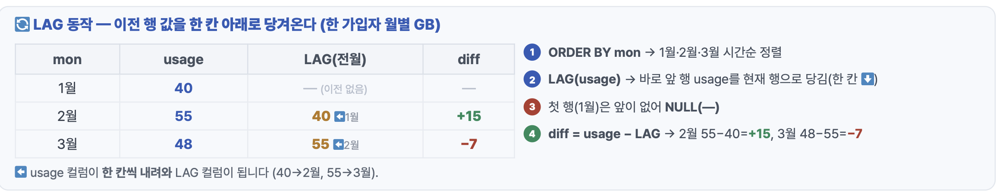

**FIRST/LAST_VALUE, NTILE**

FIRST_VALUE|창의 첫 값
LAST_VALUE|창의 마지막 값
NTH_VALUE|N번째 값
NTILE(n)|n개 구간(분위수) 분할

```sql
NTILE(4) OVER (
    ORDER BY total_usage DESC
) AS quartile
-- 1=상위 25%, 4=하위
```

**프레임, 누적합**
프레임 - 창 안에서 '어디부터 어디까지'를 계산에 넣을지 정하는 범위(ROWS/RANGE BETWEEN).

```sql
월별 누적 사용량
SUM(usage) OVER (
    PARTITION BY cust_id
    ORDER BY mon
    ROWS BETWEEN
        UNBOUNDED PRECEDING
        AND CURRENT ROW
) AS running_total
```

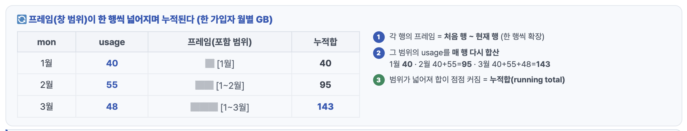

**이동평균(Moving Average)**
- 최근 N개 구간의 평균.
- 창 크기는 고정된 채 위치만 한 행씩 아래로 이동
- 평균을 내뇌, 그 창이 매 행 이동하며 계산되어서 '이동평균'
- 2 PRECEDING~CURRENT = 현재 행 + 앞 2행 = 3행. 정렬순으로 현재를 끝으로 한 가까운 3개.

```sql
3개월 이동평균
AVG(usage) OVER (
    PARTITION BY cust_id
    ORDER BY mon
        ROWS BETWEEN 2 PRECEDING
        AND CURRENT ROW
) AS ma3
```
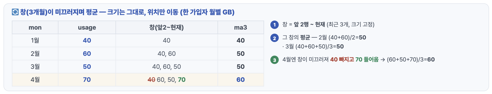


## 트랜잭션
- 하나의 논리적 작업 단위
- 더 쪼갤 수 없는 하나의 작업 묶음
- All or Nothing: 전부 확정하거나 전부 취소

### ACID - 트랜잭션의 4대 보장
A: 원자성(Atomicity)
- 모든 작업이 전부 반영 or 전부 취소. 중간에 끊켜도 깨끗하게.

C: 일관성(Consistency)
- 트랜잭션 전후로 제약, 무결성을 항상 만족하는 상태 유지.

I: 고립성(Isolation)
- 동시 실행되어도 혼자 도는 것처럼. 서로 간섭 차단
예) 상담원 A,B가 동시에 같은 고객 요금제를 변경. 고립성이 없다면 나중 저장이 앞 변경을 덮어써 한쪽이 사라짐. 격리수준을 높이면 이를 차단.

D: 지속성(Durability)
- 커밋된 결과는 정전, 크래시에도 보존.
WAL(Write-Ahead Log)에 먼저 기록 후 반영 -> 기록이 먼저라 장애가 나도 복구

### SAVEPOINT - 부분 롤백
- 트랜잭션 도중 저장지점을 찍어, 오류가 나면 처음이 아니라 그 지점까지만 되돌리는 부분 롤백 기능

```sql
저장점과 부분 취소 — 오른쪽 흐름과 번호가 같아요
BEGIN;
INSERT ... ; -- 1건 반영
SAVEPOINT sp1; -- 저장점
INSERT ... ; -- 실패
ROLLBACK TO sp1; -- 그 건만 취소
COMMIT; -- 나머지 확정
```

### 동시성 이상현상
- 고립성이 약할 때 동시에 도는 두 트랜잭션 사이에서 생기는 3가지 읽기 사고.

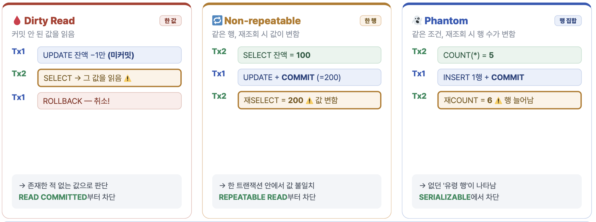

1. Dirty Read: 커밋 안 된 값을 읽음
2. Non-repeatable: 같은 행, 재조회 시 값이 변함
3. Phantom: 같은 조건, 재조회 시 행 수가 변함

격리수준을 높이면 1번부터 순서대로 차단됨.

**격리수준 4단계**
1. READ UNCOMMITTED
2. READ COMMITTED
3. REPEATABLE READ
4. SERIALIZABLE

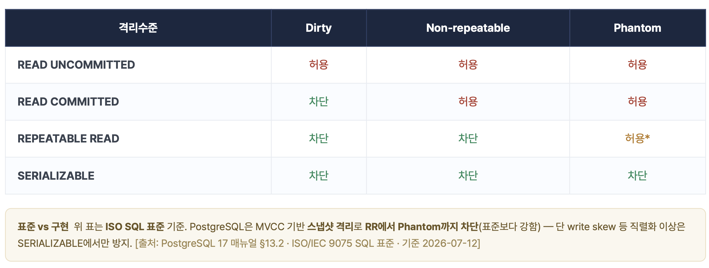

### MVCC - 다중 버전 동시성 제어
- 수정 시 기존 행을 덮어쓰지 않고 새 버전을 생성. 각 트랜잭션은 자기 시점의 스냅샷을 본다.

### LOCK
비관적 락
- 충돌을 가정 -> 미리 잠그고 시작

낙관적 락
- 잠그지 않고 일단 수정 -> 저장 직전 "그새 남이 바꿨나?"를 version 번호로 확인

Advisory Lock
개발자가 약속한 숫자를 통해 잠금 - 실제 행과 무관
```sql
SELECT pg_try_advisory_lock(42);
-- true=획득 / false=이미 잠김
```

데드락
- 서로 교착 상태
- 두 트랜잭션이 서로 쥔 락을 기다려 둘 다 멈춤.