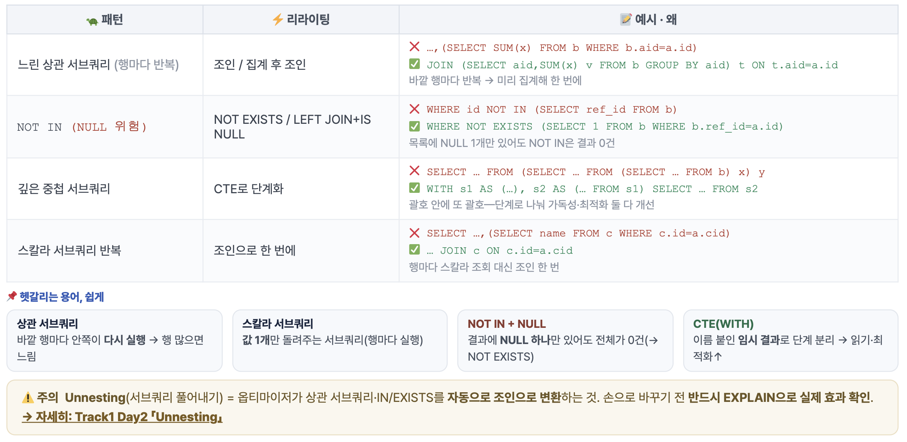

# 인덱스
**읽기는 빠르지만 데이터 변경 시 인덱스도 갱신 -> 쓰기 느려짐 + 추가 공간 필요.**

## B+Tree
**인덱스를 구현하는 자료구조**
- 루트, 내부노드는 '어디로 내려가야할 지' 키 아니면 포인터가 있음.
- 루트, 내부 노드, 리프 노드에는 실제 데이터가 없음 -> 실제 데이터는 힙에 있음.
- 리프끼리는 연결 리스트로 연결 -> 범위 스캔(BETWEEN)이 빠름.
- 리프는 실제 키 + 데이터 위치(TID)를 가지고 있음.

*TID(Tuple ID): 행의 물리적 주소 = (블록 번호, 슬롯 번호)

팬아웃: 노드 하나가 갈라지는 자식 가지 수. 클수록 높이가 낮아짐.
트리 높이: 루프에서 리프까지 단계 수. 값 하나 찾는 데 필요한 읽기 횟수와 같음.
탐색 시간: O(logN)
노드: 키 K개 -> 가지 K+1개

높이를 유지하고 팬아웃을 계속 늘리면 안되나요?
> 팬아웃을 늘리면 디스크에서 데이터를 읽기 위한 용량이 증가하며, 이는 1바이트짜리 데이터를 읽기 위해 수십 GB의 파일을 읽어와서 찾는거랑 똑같음. 그래서 보통 8KB, 16KB 등으로 팬아웃의 크기 제한하는게 좋다.

### 등치 검색 - 한 점 찾기
```sql
WHERE cust_id = 72
```
1. 루트 -> 72가 속한 범위 판단
2. 내부 노드 -> 하위 리프로
3. 리프 도달 -> 행 위치 포인터(힙)
4. 해당 행 읽기

### 범위 검색 - 한 점 찾고 옆으로
```sql
WHERE use_dt BETWEEN '01-01' AND '03-31'
```
1. 시작값 리프 찾기(등치와 동일)
2. 리프 연결 리스트 따라 옆으로 이동
3. 끝값 넘으면 종료

### 삽입과 분할
만약 꽉 찬 리프에 새 키가 들어오면?
> 노드가 담을 수 있는 최대 키 수를 초과했기 때문에 새 키를 추가한 뒤 정렬, 가운데 키(오른쪽 첫 키)를 부모로 올려 분할 진행
분할 = 쓰기 비용 발생 -> 잦으면 느려짐.

### B-Tree vs B+Tree
B-Tree
- 값이 모든 노드에 있어서 노드가 무거우며, 팬아웃 작고 높이가 큼.
- 범위 검색시, 값이 흩어져 트리를 위 아래로 순회 해야 함.

--> 데이터를 어디에 두느냐의 차이.

!! 현재는 값(실제 데이터)이 힙에 있다고 생각하자. 이는 후에 클러스터 인덱스/논 클러스터 인덱스로 나뉘어짐.

### 인덱스와 힙의 관계
```text
인덱스(안내판)
-- 키(오름차순 정렬), TID
55 -> (블록5, 슬롯7)
72 -> **(블록5, 슬롯3)** << 찾을 데이터

힙(창고)
-- 블록(삽입 순, 정렬 안 됨)
블록2: 18=..., 61=김...
블록5: 슬롯7=이..., **슬롯3=홍길동** << 실제 데이터
```
- 힙은 삽입 순이라 대량 조회 시 랜덤I/O

### 인덱스 비용
- 쓰기 오버헤드
- 저장 공간
- 옵티마이저 부담

-> 많을수록 좋은 게 아니므로, 자주 쓰는 조회 패턴에 맞춰 필요한 만큼만.

## 클러스터형 인덱스
**데이터 자체를 키 순서로 정렬해 저장. 리프 = 실제 행 -> 힙 없이 바로 도달.**
_강점_
- 힙 접근 불필요 -> 키 조회 매우 빠름
- 범위 검색 시 연속 블록 -> 디스크 효율

_약점_
- 테이블당 1개만 (한 순서로만 정렬 가능)
- 중간 삽입 시 재배치 비용 발생

```sql
CREATE CLUSTERED INDEX ix_sub ON subscription(sub_id);
```

## 비클러스터형 인덱스
**데이터와 분리된 별도 구조. 리프=키+위치포인터 -> 힙 한 번 더 읽음.**
_강점_
- 테이블당 여러 개 생성 가능
- 다양한 조회 패턴에 대응

_약점_
- 인덱스 -> 힙 2단계 접근(랜덤I/O)

```sql
CREATE INDEX ix_name ON subscription(name); -- PostgreSQL은 모두 비클러스터형 / SQL Server: NONCLUSTERED
```

> 누가 선언? -- 개발자,DBA가 DDL로 선언합니다. 옵티마이저는 만들지 않고, 조회 시 그 인덱스를 쓸지만 결정합니다.

## 그래서 어떻게 인덱스 하는데?

```sql
복합 인덱스 + 범위 조회 (ex)
CREATE INDEX idx_usage
    ON usage_log (sub_id, use_dt);

SELECT * FROM usage_log
WHERE sub_id = 1001
    AND use_dt >= '2026-01-01';
```

복합 인덱스
- 첫 컬럼으로 정렬하고 그 안에서 둘째 컬럼 정렬.
- 등치(=) 조건 컬럼을 앞
- 범위조건 컬럼을 뒤
- 선두 컬럼 미사용 시 인덱스 효과 낮아짐.
```sql
-- 순서 비교

-- 좋음: 등치→범위
(sub_id, use_dt)
WHERE sub_id=1001 AND use_dt>=…

-- 나쁨: 선두 컬럼 안 씀
(use_dt, sub_id)
WHERE sub_id=1001 → 풀스캔 위험
```

### 힙 접근 제거

```sql
CREATE INDEX idx_cov ON usage_log
(sub_id, use_dt) INCLUDE (bytes);

SELECT use_dt, bytes
FROM usage_log WHERE sub_id=1001;
-- Index-Only Scan (힙 접근 X)
```
- INCLUDE 명령어를 추가하여 인덱스 힙으로 가지 않고 비검색 컬럼도 탑재
- 힙에 가서 찾는게 아닌, bytes를 그냥 답을 해준다.
- 즉, 인덱스만(bytes포함된)으로 답 반환 -> 힙 접근 X

## 어떤 컬럼을 인덱스로 만들어야 하나요?
선택도: 쿼리 조건(WHERE)에 걸리는 행이 전체 중 차지하는 비율.
선택도가 낮다 = 걸리는 행이 적음 -> 인덱스로 콕 집는게 유리
선택도가 높다 = 대부분 걸림 -> 전체를 순차로 읽는 게 더 빠름.

(예) 98만 행에서 가입자 1명 조회 = 선택도 낮음 -> Index,
이번 달 전체 집계(100%) = 선택도 높음 -> Seq.

**높은 선택도(좋음):**
값이 다양하며 결과를 크게 좁힐 수 있는 것.
(예) 휴대폰번호, 이메일 등

**낮은 선택도(효과 적음):**
값이 몇 종류뿐이며 많은 행이 매칭되는 것.
(예) 성별, 가입상태 등

# 실행 계획 분석 및 진단
**실행 계획: 옵티마이저가 SQL을 실행하려고 세운 단계별 작업지도**

## 실행 계획 분석
1. EXPLAIN
2. ANALYZE
3. 트리 읽기

### EXPLAIN
```sql
-- EXPLAIN 출력
EXPLAIN SELECT * FROM subscription
WHERE status='활성';

-- 쿼리 대답:
Seq Scan on subscription
(cost=0.00..1850.00 rows=9800 width=64)
Filter: (status = '활성')
```
- cost: 시작, 총 예상 작업량 (내부적으로 사용하는 수치)
- rows: 옵티마이저 예상 행수
- width: 한 행 평균 크기
- seq scan: 테이블을 처음부터 끝까지 훑기

-> 약 9,800행을 처음부터 끝까지 훑고, 예상 비용은 1850 정도

### ANALAYZE 
- 명령어는 실제로 실행해봄. 진짜 병목 측정
- 만약 예상치와 실제치가 크게 다르면 통계가 낡음 신호.

### 트리 읽기
- 들여쓰기가 깊을수록(안쪽) 먼저 실행
- 결과를 위(바깥)로 올리며 합침.
```sql
Hash Join (rows=3,200 time=42ms) ③ 결합
    -> Seq Scan subscription (rows=9,800) ②
    -> Hash
      -> Index Scan customer (rows=3,200) ①
```

### 비용(cost) 모델 해석
- 디스크 I/O + CPU 연산 -> cost
- 둘을 가중합한 점수 - 초 단위가 아닌 상대점수.
> 표기는 [시작비용..총비용]

핵심은 절대값이 아니라 상대 비교이며, 옵티마이저는 최저 코스트 계획을 고르고 우리는 코스트가 튀는 노드를 병목으로 확인해야합니다.

## 행 수 추정
- cost 계산의 입력값 x 행 수

## Buffers
각 노드가 읽은 블록(Buffer) 수가 진짜 I/O 비용. 걸린 시간보다 '몇 블록을 읽었냐'를 봐야함.

```sql
EXPLAIN (ANALYZE, BUFFERS) SELECT …;

Buffers: shared hit=120 read=8500
→ hit=캐시(빠름) · read=디스크(느림)
```
- 시간보다 읽은 블록 수가 진짜 비용. 인덱스를 잘 쓰면 디스크 read가 급감한다.

## 스캔 방식
옵티마이저가 비용으로 자동 선택함.

### Seq Scan
- 테이블 처음부터 끝까지 전부 읽기
- 테이블이 적고, 대부분의 행을 읽어야 할 때.

### Index Scan
- 인덱스로 위치를 찾아 해당 행만 힙에서 읽음.
- 소수 행에 최고, 매칭이 많으면 손해.

### Index-Only Scan
- 필요한 컬럼이 인덱스에 다 있음 -> 힙 접근 필요없음.
- 커버링 인덱스의 동작.

### Bitmap Scan
- 위치를 비트맵에 모은 뒤 힙을 블록 순서로 일괄 읽음.
- 랜덤I/O 낮아짐. 중간 규모에 적합.

## 조인 방식

### Nested Loop
- 소량 + 안쪽 인덱스
### Hash Join
- 대용량 등가 조인
### Merge Join
- 정렬된 입력. 범위 조인

## 느린 쿼리 식별
```sql
-- pg_stat_statements
SELECT query, calls, mean_exec_time,
    total_exec_time
FROM pg_stat_statements
ORDER BY total_exec_time DESC LIMIT 10;
```
pg_stat_statements 익스텐션을 통해 모든 쿼리를 정규화해 호출 수, 총/평균 시간, 읽은 블록 수를 누적 집계 해줍니다.

## 병목 진단 체크리스트
|질문|원인/해법|
|---|---|
|풀스캔이 일어나는가?|인덱스 부재, 미사용 -> 인덱스/조건 수정|
|예상 vs 실제 rows 격차?|통계 문제 -> ANALYZE|
|정렬,해시가 디스크로 넘침?|work_mem 부족 -> 조정, 인덱스 정렬|
|많이 읽고 나중에 버림?|필터를 일찍 -> 조건, 조인 순서|
|조인 방식이 적절한가?|행 추정 오류 -> 통계, 인덱스|


# 쿼리 리라이팅
**같은 결과를 내되, 옵티마이저가 더 나은 계획을 찾도록 쿼리를 다시 쓰는 행위**

## 리라이팅 5대 법칙
_SARGable(Search ARGument able · 검색 인자 가능) — WHERE에 함수·연산을 씌우지 않아 인덱스를 탈 수 있는 조건_

1. SARGable 조건
2. 필요한 컬럼, 행만
3. 적절한 스캔 유도
4. 불필요 연산 제거
5. 집합적 사고

### 1. SARGable 조건
```sql
-- Before · 인덱스 미사용
WHERE EXTRACT(year FROM use_dt) = 2026

WHERE fee * 1.1 > 100000

-- After · 인덱스 사용
WHERE use_dt >= '2026-01-01'
    AND use_dt < '2027-01-01'

WHERE fee > 100000 / 1.1
```

### 2. 필요한 컬럼, 행만
```sql
-- Before
SELECT * FROM usage u JOIN …

-- After
SELECT u.used_at, u.bytes
FROM usage u
WHERE u.sub_id = 1001 -- 일찍 필터
LIMIT 100;
```

- SELECT * 금지 -> 필요한 컬럼만
- 필터를 일찍 적용해 행 먼저 축소
- 서브쿼리,CTE로 미리 집계해 작게
- LIMIT으로 필요한 만큼만

### 3. 적절한 스캔 유도
- 대부분을 읽으면 풀스캔이 정상
- 그러나, 소수 행인데 풀스캔? -> 인덱스,조건 정비
- ANALYZE usage_log; -- 통계 갱신 → 올바른 계획 세우기

### 4. 불필요한 연산 제거
- 습관적 DISTINCT
- 불필요한 ORDER BY
- 결과에 영향 없는 서브쿼리
- 중복 없는데 UNION

### 5. 집합적으로 사고하기
- SQL은 선언형
- N+1 -> 조인,IN으로 일괄처리
- 행별 UPDATE -> 조건 일괄 UPDATE
- 절차 로직 -> CASE,집계,윈도우

## 서브쿼리 리라이팅


## 페이지네이션
- 큰 목록을 20건씩 페이지 단위로 끊어 조회하는 것.

## 집계 튜닝
- 집계 계산을 빠르게 만드는 것.

사전 집계(미리계산)
- Materialized View로 캐싱
- 집계 테이블에 주기 적재(배치)
- 실시간성 덜한 대시보드,리포트

집계 자체 최적화(실시간)
- 느린 COUNT(*) 대신 근사치 조회(pg_class.reltuples)
- 인덱스 온리 스캔 유도
- 인덱스로 그룹, 정렬 미리 맞춤

## 정렬 튜닝
- ORDER BY 정렬 비용을 줄이는 것.
- 이미 정렬된 인덱스를 쓰면 정렬 자체를 건너뛴다.

## 파티셔닝
```sql
만들기 → 쓰기 (선언적 파티셔닝) · 왼쪽 ①②③④ 순서를 그대로 코드로
-- ① 키(날짜) 결정: 설계만 · 코드 없음
-- ② 부모: 파티션 키 지정
CREATE TABLE usage_log (…)
PARTITION BY RANGE (use_dt);
-- ③ 월별 자식 파티션 생성
CREATE TABLE usage_2026_02
PARTITION OF usage_log
FOR VALUES FROM ('2026-02-01') TO ('2026-03-01'); --
PostgreSQL RANGE: FROM 포함, TO 제외
→ 2/1 00:00 ~ 2/28 23:59:59… (2월 전체), 3/1은 제외
'다음 달 1일'을 상한으로 = 말일(28·29)·시각 신경 안 써도 안전
-- ④ 조회는 키 포함 → 프루닝
WHERE use_dt >= '2026-02-01' -- 02만
```
만드는 순서.
1. 키(날짜) 결정
2. 부모 Partition by range
3. 월별 자식 파티션
4. 조회 키 포함