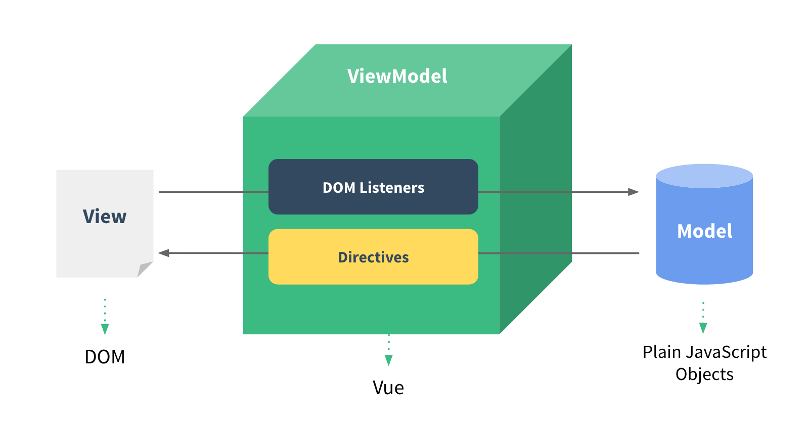
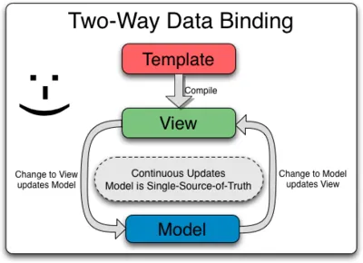
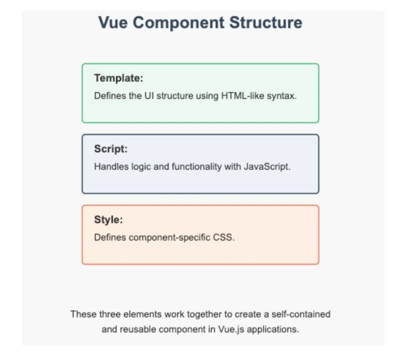

---
tags:
  - Vue
  - Skala
aliases:
  - SKALA_VUE
---
## Vue 학습

### **Vue.js 특징**
- 간결한 문법
- 반응형 데이터 바인딩
- 컴포넌트 기반
- 가상 DOM
- 트랜지션 효과 지원

### **MVVM**
데이터를 보여주는 `View`와 데이터를 처리하는 `Model` 사이에 데이터를 중개하는 `View Model`을 두어 UI를 그리는 부분과 Data 처리 로직을 완전히 분리하는 아키텍처 패턴



**Model**: 어플리케이션에서 사용하는 순수한 비즈니스 데이터(Javascript 객체, Backend REST API에서 넘어오는 데이터 자체)
**View**: 사용자에게 실제로 보여지는 화면 인터페이스(`<template>`, `<style>` 영역)
**View Model**: View와 Model 사이를 연결시켜주는 중재자.(Vue.js 엔진, `<script>`)

### Virtual DOM
Real DOM의 고질적인 렌더링 문제를 처리하기 위한 방법.
- 기존의 DOM은 변경이 발생하면 다시 계산 후 다시 색칠하는 연산을 수행
- Batch 처리를 통한 렌더링 횟수 최적화 및 최소 DOM 조작

### Two-Way Data Binding


- 양방향 데이터 바인딩
- 'Model이 바뀌면 View가 바뀌고, 반대인 경우도 바뀐다' 를 의미
- v-model directive를 사용하여 구현.


### Component Base Architecture

웹페이지를 통째로 만드는 것이 아닌, 독립적인 UI 부품들을 각각 만든 뒤 조립하여 화면을 완성하는 방식.
- `캡슐화`: 컴포넌트는 내부의 HTML, JS, CSS를 하나의 파일(.vue) 안에 응집시킴.
- `재사용성`: 한 번 만들어 놓으면 여러 곳에서 다시 가져다 쓸 수 있어 중복 코드가 제거됨.
- `Tree Structure`: 컴포넌트는 부모-자식 관계를 가지며, 부모가 자식에게 데이터를 내려주고(Props), 자식은 부모에게 상태 변경을 알린다(Emit)

### CSR vs SSR
- 화면 렌더링 방식에는 2가지가 존재
- 화면을 구성하는 HTML 파일을 어디서 최종적으로 완성하는가?
- CSR(Client-Side Rendering): 브라우저가 자바스크립트를 직접 실행하여 화면에 그리는 방식 Vue.js의 기본 동작 렌더링 방식
- SSR(Server-Side Rendering): 서버에서 데이터까지 모두 주입된 HTML 파일을 만들어서 브라우저에 내려주는 방식 Vue의 Nuxt.js 프레임워크를 사용해서 구현

| ==비교 항목==    | ==CSR(기본 Vue.js / SPA)== | ==SSR(Vue + Nuxt.js)==      |
| ------------ | ------------------------ | --------------------------- |
| HTML 완성 주체   | 브라우저 (클라이언트)             | 웹 서버                        |
| 초기 서버 전송 데이터 | 빈 HTML + 대용량 JS 파일       | 데이터가 결합되어 완성된 HTML          |
| 초기 화면 표시 속도  | 느림 (JS 다운로드 및 실행 대기)     | 매우 빠름 (HTML 즉시 렌더링)         |
| 페이지 이동 속도    | 매우 빠름 (서버를 거치지 않음)       | 다소 느림 (서버가 다음 페이지를 또 그려야 함) |
| 검색엔진 최적화     | 불리함 (봇이 빈 화면으로 인식)       | 강력함 (완성된 텍스트 수집 가능)         |

### SPA
단일 페이지 어플리케이션
- 브라우저가 서버로부터 오직 딱 하나의 HTML 페이지만 받아서 구동되는 웹 어플리케이션 구조.

==장점==
- 압도적인 사용자 경험(UX): 페이지 이동이 데스크톱 소프트웨어처럼 즉각적
- 네트워크 효율성: 한 번 로딩된 리소스를 재사용하고 데이터만 주고받으므로 네트워크 트래픽 절감
- 프론트/백엔드 분리: 프론트는 Vue만 담당하고, 백엔드는 데이터만 담당하므로 개발 팀 간의 협업 및 서버 분산이 명확
==단점==
- 초기 로딩 속도
- SEO 취약

### MPA vs SPA
| 구분        | MPA(Multi Page Application)     | SPA(Single Page Application)      |
| --------- | ------------------------------- | --------------------------------- |
| 페이지 구성 방식 | 요청할 때마다 새로운 HTML 페이지를 서버에서 전송   | 초기 로딩 시 하나의 HTML 페이지와 대용량 JS 로딩   |
| 페이지 전환    | 서버로 요청 -> 전체 페이지 새로 고침          | 클라이언트에서 JS로 필요한 부분만 변경 (부분 렌더링)   |
| 요청 처리 방식  | 요청 시마다 서버에서 HTML 렌더링 (SSR)      | 데이터는 API로 받아오고 렌더링은 브라우저 수행 (CSR) |
| 속도        | 초기 로딩 매우 빠름, 페이지 전환 속도 다소 느림    | 초기 로딩 느림, 페이지 전환 속도 매우 빠름         |
| 새로고침      | 자연스럽게 동작                        | 전체 앱이 다시 로딩되어 상태가 초기화될 수 있음       |
| SEO       | HTML이 서버에서 렌더링되므로 SEO에 유리       | JS 기반 렌더링으로 SEO가 불리함 (보완가능)       |
| 기술 스택 예시  | JSP, PHP, ASP.NET, Spring MVC 등 | Vue.js, React, Angular + REST API |

### 추가 기술 요소
- **Vue Router**: 브라우저의 URL 주소와 Vue 컴포넌트를 연결해 주는 공식 라우팅 라이브러리
- **Pinia**: 전역 상태 관리 라이브러리로 모든 컴포넌트가 접근할 수 있는 중앙 집중식 데이터 저장소(Store)를 메모리 상에 개설한다.
 - **Axios**: 백엔드 서버(API 서버)와 순수한 데이터(JSON)만 주고받는 통신 창구.
- **Vite**: Frontend Build Tool로 개발자가 작성한 수많은.vue, .js, .css 파일들을 브라우저가 읽을 수 있는 최적화된 형태의 정적 파일로 묶어주고, 개발 서버를 띄워주는 빌드 도구(Bundler)이다.

### Node.js
- Vue 개발에서 Node.js가 하는 역할은 다음과 같음
	- 빌드도구 실행 엔진
	- 패키지 관리
	- 로컬 개발 서버 구동

### Frontend Project Tools
- 웹 UI 개발 방식의 변화
	- 파일 분할과 모듈화: 유지보수와 재사용성을 위해 자바스크립트를 여러 파일로 나누어 작성
	- 사이즈 최적화: 어플리케이션 배포 시 전체 파일을 묶고 크기를 줄여야 함
	- 브라우저 호환: 구 버전 브라우저에서 ES6 이후의 문법, Typescript 등을 사용할 수 있는 변환 과정 필요
- 개발 편의를 위한 자동화
	- 변경 시 자동 새로 고침(Live Reload, HMR)
	- 코드 압축, 이미지 최적화, CSS 전처리
	- .vue, .scss, .ts 등 다양한 확장자 파일 처리

- Vite, npm
## 프로젝트 구조
### package.json
```json
{

	"name": "skala-vue",
	
	"version": "0.0.0",
	
	"private": true,
	
	"type": "module",
	
	"scripts": {
		"dev": "vite --host",
		
		"build": "vite build",
		
		"preview": "vite preview",
		
		"lint": "run-s lint:*",
		
		"lint:oxlint": "oxlint . --fix",
		
		"lint:eslint": "eslint . --fix --cache",
		
		"format": "prettier --write --experimental-cli src/"
	},
	
	"dependencies": {
	
		"axios": "^1.18.1",
		
		"element-plus": "^2.14.2",
		
		"pinia": "^3.0.4",
		
		"vue": "^3.5.32",
		
		"vue-router": "^5.0.4"
		
	},
	
	"devDependencies": {
	
		"@eslint/js": "^10.0.1",
		
		"@vitejs/plugin-vue": "^6.0.6",
		
		"eslint": "^10.2.1",
		
		"eslint-config-prettier": "^10.1.8",
		
		"eslint-plugin-oxlint": "~1.60.0",
		
		"eslint-plugin-vue": "~10.8.0",
		
		"globals": "^17.5.0",
		
		"npm-run-all2": "^8.0.4",
		
		"oxlint": "~1.60.0",
		
		"prettier": "3.8.3",
		
		"vite": "^8.0.8",
		
		"vite-plugin-vue-devtools": "^8.1.1"
		
	},
	
	"engines": {
		
		"node": "^20.19.0 || >=22.12.0"
		
	}

}
```

- Meta 정보
- script 명령어 정보
- 의존성 모듈 정보
- 실행 환경 제약

4가지 섹션으로 구성되며, 각 정보들은 위 예시에서 하나씩 살펴볼 것.

### index.html
```html
<!doctype html>

<html lang="">

<head>

<meta charset="UTF-8" />

<link rel="icon" href="/favicon.ico" />

<meta name="viewport" content="width=device-width, initial-scale=1.0" />

<title>SKALA-VUE : 모던 웹 애플리케이션 개발 실습실</title>

</head>

<body>

<div id="app"></div>

<script type="module" src="/src/main.js"></script>

</body>

</html>
```

- 어플리케이션의 `진입점(Entry Point)`로 브라우저가 최초로 읽는 단 하나의 HTML.
- div#app 안에서 Vue 엔진이 컴포넌트들을 실시간으로 바꿔 끼워 화면을 그린다.
- main.js를 모듈 형식으로 연결하여 이때부터 Vue 어플리케이션에서 사용할 패키지와 코드가 실행된다.
### main.js
```js
import './assets/main.css'
import { createApp } from 'vue'
import { createPinia } from 'pinia'
import App from './App.vue'
import router from './router'
import ElementPlus from 'element-plus'
import 'element-plus/dist/index.css'

const app = createApp(App)

app.use(createPinia())
app.use(router)
app.use(ElementPlus)

app.mount('#app')
```
- 파일은 뷰 어플리케이션을 초기화하고 구성하는 역할을 담당
- createApp() Vue3 어플리케이션을 시작할 때 가장 먼저 사용하는 핵심 인스턴스 생성 함수
- 이 최상위 컴포넌트를 기점으로 하위 컴포넌트들이 Component Tree를 형성하며 렌더링 파이프라인을 구축함
- 생성된 app 객체는 앱 전체에 영향을 주는 전역 설정과 등록을 담당
### App.vue
```vue
<script setup>
import { RouterLink, RouterView } from 'vue-router'
import HelloWorld from './components/HelloWorld.vue'
</script>

  

<template>

<header>


<div class="wrapper">

<HelloWorld msg="You did it!" />

<nav>

<RouterLink to="/">Home</RouterLink>
<RouterLink to="/about">About</RouterLink>

</nav>

</div>

</header>

  

<RouterView />

</template>

  

<style scoped>

header {

line-height: 1.5;

max-height: 100vh;

}

  

.logo {

display: block;

margin: 0 auto 2rem;

}

  

nav {

width: 100%;

font-size: 12px;

text-align: center;

margin-top: 2rem;

}

  

nav a.router-link-exact-active {

color: var(--color-text);

}

  

nav a.router-link-exact-active:hover {

background-color: transparent;

}

  

nav a {

display: inline-block;

padding: 0 1rem;

border-left: 1px solid var(--color-border);

}

  

nav a:first-of-type {

border: 0;

}

  

@media (min-width: 1024px) {

header {

display: flex;

place-items: center;

padding-right: calc(var(--section-gap) / 2);

}

  

.logo {

margin: 0 2rem 0 0;

}

  

header .wrapper {

display: flex;

place-items: flex-start;

flex-wrap: wrap;

}

  

nav {

text-align: left;

margin-left: -1rem;

font-size: 1rem;

  

padding: 1rem 0;

margin-top: 1rem;

}

}

</style>
```

- Vue 어플리케이션의 Root Component 역할을 한다.
- Vue-router: 주소창에 따라 화면을 전환하기 위해 Vue Router가 제공하는 RouterLink와 RouterView를 가져온다.
- `<RouterView />` 위치가 실제 화면이 갈아 끼워지는 가변형 주입구역.

## SFC
Single File Component



- vue 컴포넌트는 .vue 확장자를 가진 하나의 독립된 파일로 구성됨.

**SFC 3단 구조**

| 이름               | 설명                                     |
| ---------------- | -------------------------------------- |
| `<script setup>` | 데이터, 함수 등 기능 로직을 JS로 작성하는 곳            |
| `<template>`     | 사용자에게 보여질 HTML 구조를 작성하는 곳              |
| `<style>`        | CSS 스타일을 작성하는 곳(보통 scoped로 적용 범위를 제한함) |

### Options API vs Composition API
- Vue 컴포넌트의 Script 영역을 작성하는 방법

| 비교 항목         | Options API (Vue 2 방식)                                                | Composition API (Vue 3 표준)                                                 |
| ------------- | --------------------------------------------------------------------- | -------------------------------------------------------------------------- |
| 코드 선언 구조      | `<script>`                                                            | `<script setup>`                                                           |
| 작성 철학         | 역할별 격리 (Options 기반),<br>정해진 상자(data, methods, computed) 안에 코드를 나누어 배치 | 논리적 기능별 그룹화 (Fuction 기반)<br>순수 자바스크립트처럼 관련 있는 데이터와 함수를 한 곳에 연달아 묶어 작성하는 방식 |
| 코드 가독성        | 하나의 기능을 수정하기 위해 파일 상단 data와 하단 methods를 계속 오르내림                       | 하나의 기능에 필요한 데이터와 로직이 한 구역에 모여 있어 한 눈에 파악 가능.                               |
| 반응성 변수 선언     | data() 함수가 반환하는 객체 내부에 선언                                             | ref() 또는 reactive() 내장 함수를 사용해 선언                                          |
| 코드 재사용성       | Mixin을  사용하나, 데이터 출처가 불분명해지고 이름 충돌 가능성이 높음                            | Composable 함수를 사용해 순수 자바스크립트 함수 형태로 완벽하게 격리 및 재사용 가능                       |
| TypeScript 호환 | 구조적 한계로 인해 타입 추론 및 결합이 매우 복잡하고 부자연스러움.                                | 순수 함수 및 변수 기반이므로 TypeScript와 100% 호환 및 자동 추론 가능.                           |
| 공식 권장 여부      | 레거시 유지보수 외에는 신규 권장 안함.                                                | 현재 Vue3 공식 문서 및 생태계 기본 표준                                                  |

### Interpolation & Directive

Vue 컴포넌트의 Template 영역 작성하는 방법
- Text Interpolation (텍스트 보간법)
	- {{ 변수명 }}
	- 용도: JS 변수 값을 그대로 문자열로 투사하고 싶을 때 사용
- Directive
	- v-로 시작하는 Vue 전용 특수 속성 (v-bind, v-if, v-for, v-on 등)
	- 용도: 일반 HTML 태그 안에서 태그의 속성, 스타일, 조건문, 반복문, 이벤트 리스너 등을 자바스크립트 데이터와 연결하여 제어하기 위해 사용
```vue
<template>
	<div>
		<h1>Composition API Counter</h1>
		<p>Count: {{ count }}</p>
		<button @click="increment">Increment</button>
	</div>
</template>
```


**Project Scaffolding**: 개발에 필요한 기본 디렉토리 구조, 빌드/스타일 설정, 공통 모듈등을 자동으로 생성하여 초기 개발 환경(뼈대)을 구성하는 작업


