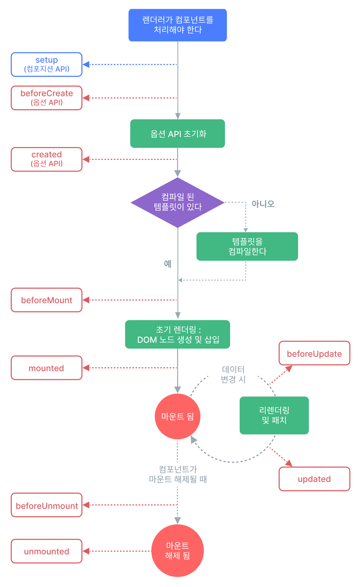
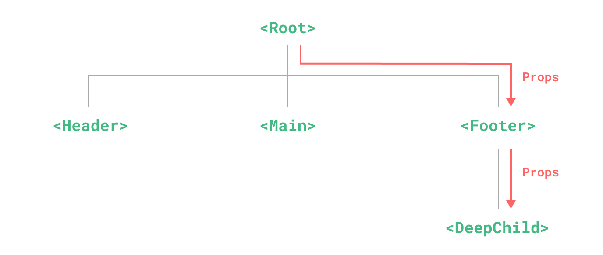

---
aliases:
  - SKALA_VUE
tags:
  - Vue
  - Skala
---
[[Day 2]] 이어서 작성.

# Vue Component

- 웹페이지를 구성하는 독립적이고 재사용이 가능한 블록(부품)을 말한다.
- SFC
- 하나의 어플리케이션을 완성하기 위해 여러 개의 컴포넌트를 사용
- 컴포넌트는 일정한 형식을 가지고 내부적으로 `트리`구조로 연결

## Overview


- Parent-Child
	- 다른 컴포넌트를 품고 있는 상위 블록이 **부모**, 그 안에 박혀서 작동하는 하위 블록이 **자식**
	- 부모와 자식은 철저하게 독립된 상태로, 서로의 변수나 정보를 가져다 사용할 수 없음
- Sibling
	- 동일한 부모 컴포넌트 아래에 나란히 조립된 자식 컴포넌트끼리의 관계
	- 형제끼리는 다이렉트로 대화하는 선이 없음. 형제에게 말을 걸고 싶으면, 반드시 부모를 통해서
- Ancestors-Descendants
	- 컴포넌트가 거대해져 자식의 자식, 그 자식의 자식까지 내려가는 다중 계층 구조

### Component Local Registration

- 부모 컴포넌트가 자식 컴포넌트를 import하여 사용
- 등록된 자식 컴포넌트는 `<template>` 영역에서 내장 태그처럼 사용 가능
- PascalCase, kebab-case 스타일로 호출

```js
<script setup>
import BaseButton from './components/BaseButton.vue'
</script>

<template>
	<div class="box">
		<h3>컴포넌트 조립 테스트</h3>
		<hr />
		<BaseButton />
		<base-button></base-button>
	</div>
</template>
```

### Component Global Registration

- 전역 등록된 컴포넌트는 뷰 어플리케이션 모든 곳에서 별도 절차 없이 사용 가능
- 전역 등록은 main.js 파일에서 함

```js
import { createApp } from 'vue'
import App from './App.vue'

import BaseButton from './components/BaseButton.vue'
import BaseInput from './components/BaseInput.vue'

const app = createApp(App)

// app.component()를 사용해 등록, 인자 (<template>에서 호출할 태그 이름, 위에서 import 한 컴포넌트 변수명)
app.component(＇BaseButton＇, BaseButton)
app.component(＇BaseInput＇, BaseInput)

// 아래처럼 체이닝(Chaining) 형태로 줄여 쓸 수도 있다.
app.component('BaseButton', BaseButton).component('BaseInput', BaseInput)

app.mount('#app')
```

## Lifecycle

| 단계    | 현재 상태                                                       | 상세 내용                                                                         |
| ----- | ----------------------------------------------------------- | ----------------------------------------------------------------------------- |
| 1. 생성 | 컴포넌트가 메모리상에 막 태어난 단계 (JavaScript 상에만 존재하고, 아직 HTML 에는 안 붙음) | 데이터(ref, reactive)와 computed, watch 센서들이 초기화되어 가동을 시작함.                       |
| 2. 부착 | 가상으로 만들던 화면을 진짜 브라우저 HTML (DOM)에 붙인 단계                      | 화면 요소(div, button 등)에 직접 접근할 수 있게 되며, 백엔드 API를 호출하여 초기 데이터를 받아오기에 가장 완벽한 타이밍. |
| 3. 갱신 | 반응형 데이터(ref 등)가 바뀌어서 화면을 싹 뜯어고치고 다시 그리는(Re-rendering) 단계    | 데이터가 변했을 때 화면이 새로 그려진 직후, 바뀐 HTML 요소들의 크기나 스크롤 위치를 다시 계산할 때 씀.                |
| 4. 소멸 | v-if="false" 등으로 인해 컴포넌트가 화면에서 완전히 지워지고 파괴되는 단계             | 메모리 누수를 막기 위해 사용 중이던 실시간 타이머(setInterval)를 끄거나, 전역 이벤트 리스너를 청소(Clean-up)함.    |

### Lifecycle Hooks


| 단계            | 훅 함수              | 설명                                          |
| ------------- | ----------------- | ------------------------------------------- |
| 생성 전          | **setup()**       | 컴포넌트 생성 전 가장 먼저 실행.<br>reactive 변수 및 함수 초기화 |
| 마운트 전         | onBeforeMount()   | DOM에 마운트되기 직전에 호출                           |
| 마운트 완료        | **onMounted()**   | DOM에 마운트된 후 호출.<br>초기 DOM 조작, API 호출 등에 사용  |
| 업데이트 전        | onBeforeUpdate()  | 반응형 데이터가 변경되어 DOM이 다시 업데이트되기 전              |
| 업데이트 후        | **onUpdated()**   | DOM 업데이트가 완료된 후 호출                          |
| 언마운트 전        | onBeforeUnmount() | 컴포넌트가 DOM에서 제거되기 직전에 호출                     |
| 언마운트 완료       | **onUnmounted()** | 컴포넌트가 DOM에서 제거된 후 호출                        |
| 에러 처리 (선택)    | onErrorCaptured() | 자식 컴포넌트에서 에러가 발생했을 때 캡처                     |
| 렌더 트리 캐시 복구용  | onActivated()     | `<KeepAlive>` 안에서 재활성화될 때 호출                |
| 렌더 트리 캐시 비활성화 | onDeactivated()   | `<KeepAlive>` 안에서 비활성화될 때 호출                |

## Props & Emits
- 모든 컴포넌트 연동은 "데이터는 위에서 아래로, 이벤트는 아래에서 위로"

| 분류             | Props                    | Emits                  |
| -------------- | ------------------------ | ---------------------- |
| 개념 정의          | 부모가 자식에게 주는 반응형 데이터 값    | 자식이 부모에게 보고하는 이벤트      |
| 흐름 방향          | 부모 -> 자식                 | 자식 -> 부모               |
| 데이터 권한         | 읽기 전용, 자식은 수정 불가         | 부모에게 변경 요청 및 값 전달 가능   |
| Compiler Macro | `defineProps({ ... })`   | `defineEmits([ ... ])` |
| Parent Binding | 자식 태그 속성에 콜론(**:**)으로 주입 | 자식 태그 이벤트에 **@**로 청취   |

### defineProps
- 자식 컴포넌트 내부에서 "부모가 넘겨줄 데이터의 이름과 규격"을 선언
- 데이터는 camelCase로, 속성은 kebab-case로 작성
	- 즉, defineProps 에서는 camelCase, `<template>` 에서는 kebab-case로 작성
	- 이는 HTML이 대소문자 구분을 못하고 전부 소문자로 인식하기 때문.

```js
// 배열 형식
const props = defineProps(['title', 'count'])

// 객체 형식
defineProps({
	// 1. 타입만 간단히 지정하는 경우
	title: String,
	
	// 2. 필수 값과 기본값까지 꼼꼼하게 지정하는 경우
	likes: {
		type: Number,
		required: true // 부모가 이 값을 안 넘기면 에러발생.
	},
	
	status: {
		type: String,
		default: ＇대기 중＇ // 부모가 값을 안 주면 이 값이 기본으로 세팅.
	}
})
```

```js
<script setup>
// 변수에 결과를 할당합니다.
const props = defineProps({
	title: String,
	likes: Number
})

// 내부 함수에서 쓸 때는 props.을 앞에 꼭 붙여야 합니다.
const checkPopularity = () => {
	if (props.likes > 100) {
	console.log(`${props.title}은 인기 게시글입니다.`)
	}
}
</script>

// 부모 컴포넌트 사용 예시
<script setup>
import { ref } from 'vue';
import ChildComponent from './ChildComponent.vue';

const parentMessage = ref('안녕하세요, 자식 컴포넌트!');
</script>

<template>
	<ChildComponent :message="parentMessage" />
</template>

```


#### Props Validation
```js
defineProps({
	// 커스텀 유효성 검사기(Validator): 내 입맛대로 세부 조건 필터링
	score: {
		type: Number,
		validator(value) {
			// 값이 0부터 100 사이일 때만 합격(true)
			return value >= 0 && value <= 100
		}
	}
})
```

#### Vue Props 지원 자료형

| 유형  | 기입방법                  | 데이터 예시                   | 특징                                                     |
| --- | --------------------- | ------------------------ | ------------------------------------------------------ |
| 문자열 | String                | "서울", "25도", "맑음"        | 따옴표로 감싸진 모든 텍스트                                        |
| 숫자  | Number                | 25, -5, 3.14             | 소수점, 음수 포함 모든 숫자                                       |
| 논리형 | Boolean               | true, false              |                                                        |
| 배열  | Array                 | `['서울', '부산', '울산']`     | 대괄호로 묶인 데이터 목록, default 지정 시 함수 형태 `() => []`로 작성      |
| 객체  | Object                | { name: '부산', temp: 25 } | 키-값 쌍으로 이루어진 데이터, default 지정 시 함수 형태 `() => ({ })`로 작성 |
| 함수  | Function              | () => console('click')   | 자식 컴포넌트가 실행할 콜백 함수 통째로 (사용빈도 낮음)                       |
| 기타  | Date, Symbol, Promise | new Date() 등             | 특정 날짜 객체나 비동기 객체 검증도 지원                                |

```js
defineProps({
	// 1. 문자열 (String)
	cityName: String,
	
	// 2. 숫자 (Number)
	temperature: Number,
	
	// 3. 논리형 (Boolean)
	isActive: {
		type: Boolean,
		default: false
	},
	
	// 4. 배열 (Array)
	weeklyForecast: {
		type: Array,
		// 중요: 배열의 기본값은 무조건'새 바구니를 구워내는 화살표 함수' 형태로!
		default: () => []
	},
	
	// 5. 객체 (Object)
	coordinates: {
		type: Object,
		// 중요: 객체의 기본값도 무조건 화살표 함수 형태로 반환!
		default: () => ({ lat: 37.5, lng: 126.9 })
	}
})
```

### defineEmits

- 자식 컴포넌트가 부모에게 사용자 정의 이벤트를 전달하기 위해 사용하는 매크로 함수
- 브라우저 표준 이벤트또는 내부 로직 변화를 트리거 삼아, 부모 컴포넌트가 등록한 커스텀 이벤트 리스너를 호출하여 콜백 함수를 실행

```js
// 자식 컴포넌트
<script setup>
const emit = defineEmits(['childEvent']);

const sendToParent = () => {
	emit('childEvent', '안녕하세요, 부모 컴포넌트!');
};
</script>

<template>
	<button @click="sendToParent">부모에게 메시지 보내기</button>
</template>

// 부모 컴포넌트
<script setup>
import { ref } from 'vue';
import ChildComponent from './ChildComponent.vue';

const handleChildEvent = (message) => {
	console.log('자식으로부터 받은 메시지:', message);
};
</script>

<template>
	<ChildComponent @childEvent="handleChildEvent" />
</template>
```

### Provide & Inject



- **Props Drilling:** 컴포넌트 아키텍처의 계측이 깊어질 때, 중간에 위치한 컴포넌트들은 해당 데이터가 필요 없음에도 오직 최하위 컴포넌트로 전달하기 위해 Props를 받아 아래로 토스하는 과정을 반복해야 하는 현상

 
- 이를 해결하기 위해 중간 계층을 건너뛰는 Provide & Inject 로 해결
- Pinia로 인해 사용빈도는 그닥 많지 않음

## Slot

- 자식 컴포넌트의 특정 구역을 비워두고, 부모 컴포넌트가 자식 컴포넌트를 호출하는 시점에 마크업과 템플릿 콘텐츠를 주입하여 렌더링하는 기능
- Default Slot
- Named Slot
- Scoped Slot

### Default Slot
- 별다른 속성 없이 단순하게 `<slot>` 태크만 사용
```

```

### Named Slot
- 여러 개의 slot을 사용할 때 name 속성을 지정 `<slot name='value'></slot>`
- 부모 컴포넌트는 v-slot을 사용해서 지정 `<template v-slot:value>Value<t/template>`
```

```

### Scoped Slot
```

```


## Vue Router

- 전통적인 웹사이트는 페이지 이동 시마다 서버에 새 HTML을 요청하여 화면 전체를 새로고침함.
- 반면, Vue는 최초 접속 시 하나의 HTML만 다운로드하는 SPA 구조.
- Vue Router는 브라우저 URL 변화를 JS 엔진이 가로채서, 서버에 새 페이지를 요청하지 않고 현재 주소에 매칭되는 미리 정의된 컴포넌트만 가상 DOM 상에서 실시간으로 교체해 주는 공식 라이브러리
### Router Setup

#### 1. Vue Router 설정
- src/router/index.js
- `createRouter()`를 사용해 Router Configuration Object를 생성
- `history: createWebHistory()`는 전통적인 웹 어플리케이션에서 사용하는 방식으로 슬래시(/)를 사용해 URL을 관리한다.
- `routes`: 배열로 된 routes object를 지정한다.
	- `path`:String - 필수, 브라우저 URL 경로
	- `component`:Component | Function - 필수, path에 매핑되는 컴포넌트
	- `name`:String - 고유 식별 이름
	- `redirect`: String | Object - 강제 리다이렉션 시킬 경로 지정
- 컴포넌트 속성 지정 방식
	- 정적 Import - 어플리케이션 시작 시점에 메모리에 로드
	- 동적 Import - 해당 컴포넌트가 필요한 순간 로드(Lazy)

#### 2. Vue Router 등록
- src/main.js
- 생성한 라우터 설정을 Vue 어플리케이션에 등록
- 등록할 때는 인스턴스의 use() 메서드를 사용

#### 3. Router 사용
- `<RouterView>`: 경로와 일치하는 컴포넌트 배치
- `<RouterLink to="...">`: 링크를 생성

### Views
- views 폴더
	- views 폴더에 위치한 컴포넌트들은 `<RouterView/>` 영역에 직접 렌더링되는 "페이지 단위 최상위 컴포넌트이다."

| 구분        | views 폴더                               | components 폴더                |
| --------- | -------------------------------------- | ---------------------------- |
| 주요 역할     | 페이지 단위 컴포넌트                            | 재사용 가능한 UI / 기능 컴포넌트         |
| Router 매핑 | RouterView에 직접 매핑                      | RouterView에 직접 매핑 X          |
| 재사용성      | 낮음                                     | 높음                           |
| 예시 컴포넌트   | DashboardView.vue, UserProfileView.vue | AppButton.vue, SearchBar.vue |

### useRoute()
- Script Setup 환경에서 현재 활성화된 라우트(Active Route) 정보에 접근하기 위한 Composable 함수[^1]
- URL 경로, 파라미터, 쿼리 스트링, 메타 데이터등 현재 페이지의 모든 상태 정보를 reactive 객체 형태로 제공

주요 프로퍼티
- route.params: 동적 경로 파라미터
- route.query: URL 쿼리 스트링
- route.path: 요청된 URL 순수 경로
- route.name: 해당 라우스 설정에 고유 이름

### useRouter()
- 라우터 인스턴스에 접근하기 위한 Composable 함수[^1]
- 페이지를 이동할 때 활용
- Programmatic Navigation

주요 메서드
- router.push(): 히스토리 항목을 스택에 추가하며 페이지 이동 (뒤로 가기 가능)
- router.replace(): 히스토리 항목을 대체하며 페이지 이동 (뒤로 가기 불가능)
- router.go(n): 히스토리 스택에서 n단계만큼 앞/뒤로 이동

### Navigation Guard
- 특정 라우트로 진입하기 직전, 중간에 가로채서 접근 권한 검사 및 페이지 리다이렉션 같은 사용자 정의 로직을 실행할 수 있게 함
- 전역 가드, 라우터별 가트, 컴포넌트 내 가드로 구분

| Hook Method          | 트리거 시점                                           | 주요 사용 케이스      |
| -------------------- | ------------------------------------------------ | -------------- |
| router.beforeEach    | 새로운 라우트로 이동이 시작되기 직전                             | 접근 권한 통제 및 보안  |
| router.beforeResolve | 라우트 진입 전, 컴포넌트 내부 가드와 비동기 라우트 컴포넌트 분석이 모두 완료된 직후 | 최종 데이터 검증 및 승인 |
| router.afterEach     | 네비게이션이 완전히 종결되어 화면 전환이 완료된 후                     | 후속 처리 및 로그 기록  |

### Unmatched Route Handling
- Route 미매핑 시 발생 상황
- 라우트 등록 목록의 가장 마지막에 Catch-all Route를 배치
```
const routes = [
	{
		path: '/',
		name: 'Home',
		component: HomeView
	},
	// ... 기타 정의된 라우트들...
	
	// 상단 라우트와 매칭되지 않는 모든 경로를 NotFoundView로 리다이렉트
	{
		path: '/:pathMatch(.*)*',
		name: 'NotFound',
		component: NotFoundView
	}
]
```


## Pinia
- 중앙 집중식 상태 관리
- Pinia DevTools를 통한 강력한 상태 추적
- 명확하고 예측 가능한 상태 변경 패턴 제공

### Store
- 여러 파일로 구성될 수 있으며, 일반적으로 의미가 있는 상태끼리 파일 하나로 작성
- 예) 인증스토어(auth.js), UI스토어(uiStore.js), 알림스토어(alertStore.js) 등

| 용어      | 기술적 본질        | Vue3 내장 문법 매핑      | 주요 역할                                             |
| ------- | ------------- | ------------------ | ------------------------------------------------- |
| state   | 반응형 데이터 변수    | ref() / reactive() | 전역으로 공유할 상태 데이터 객체를 정의                            |
| getters | 읽기 전용 계산된 변수  | computed()         | 원본 state를 기반으로 실시간 가공                             |
| actions | 상태 변경 및 통신 함수 | function()         | 1. state 값을 변경하는 핸들러 로직<br>2. 서버 비동기 API 통신 작업 수행 |

### Pinia Setup

#### 1. 등록
- src/main.js
- createPinia() 함수를 통해 pinia 인스턴스 생성

#### 2. Store 생성
- src/stores/스토어명.js
- defineStore() 함수로 생성
- Store Instance를 할당하는 변수의 식별자는 ==use+파일명+Store== 규칙에 따라 작성한다.

#### 3. Store 사용
- Import Store
- Instance 가동
- state/getter/action 사용
```js
<script setup>

// 1. 정의한 카운터 스토어 플러그인 import
import { useCounterStore } from '@/stores/counter.js'

// 2. 인스턴스 가동 (전역 저장소 포인터 확보)
const counterStore = useCounterStore()
</script>

<template>
	<div class="practice-section">
	<h2>Counter Store 활용 실습</h2>
	<p>
		원본 카운트 데이터(state): <strong>{{ counterStore.count }}</strong>
	</p>
	
	<p>
		2배 연산 데이터(getters): <span>{{ counterStore.doubleCount }}</span>
	</p>
	
	<button @click="counterStore.increment">숫자 1 증가 (actions)</button>
	</div>

</template>
```


[[Day 4]] 이어서 계속.

[^1]: Vue의 반응형 상태변수와 로직을 묶어 재사용할 수 있도록 만든 함수