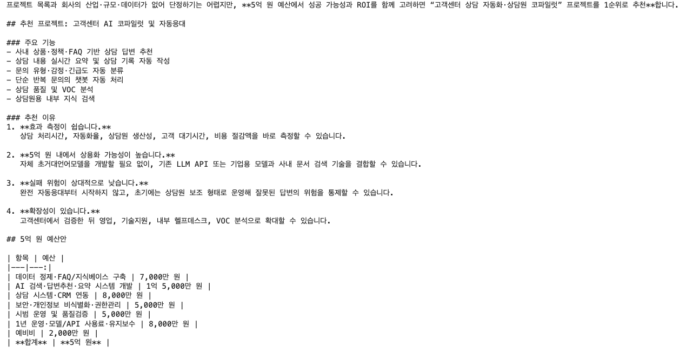
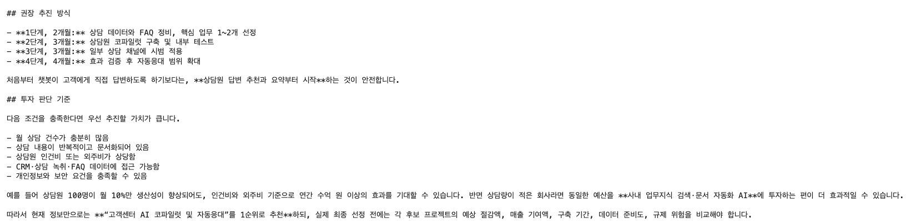
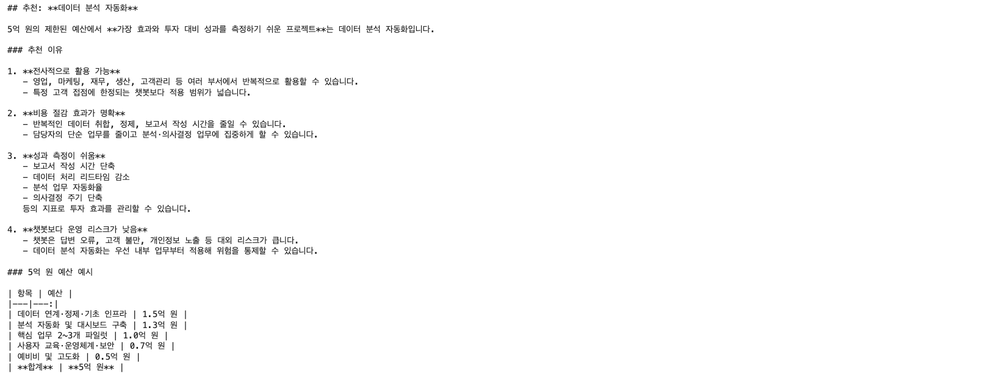
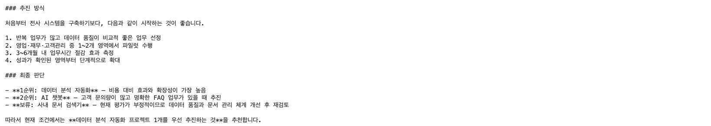
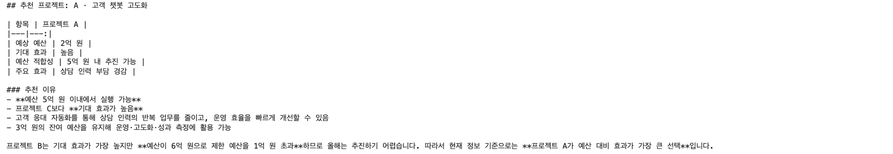
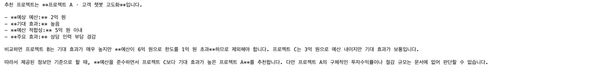

# Prompt설계와 ContextEngineering
## 4반 U110 김근홍

## 문제 1.

### 프롬프트

```
현재 회사는 여러 AI 프로젝트를 검토 중이며, 제한된 예산 5억 원 안에서 가장 효과가 큰 프로젝트 1개를 추천해줘.
```
### 응답 화면



- AI가 제시한 프로젝트: 고객센터 AI 코파일럿 및 자동응대
- AI가 제시한 예산 숫자:

| 항목                    |          예산 |
| --------------------- | ----------: |
| 데이터 정제·FAQ/지식베이스 구축   |    7,000만 원 |
| AI 검색·답변추천·요약 시스템 개발  | 1억 5,000만 원 |
| 상담 시스템·CRM 연동         |    8,000만 원 |
| 보안·개인정보 비식별화·권한관리     |    5,000만 원 |
| 시범 운영 및 품질검증          |    5,000만 원 |
| 1년 운영·모델/API 사용료·유지보수 |    8,000만 원 |
| 예비비                   |    2,000만 원 |
| **합계**                |    **5억 원** |

- 이 숫자는 실제 사내 데이터와 일치하는가?: 사내 데이터 중 "고객 챗봇 고도화" 프로젝트화 유사하지만 터무니 없는 내용이 작성됨.
- 환각이 있었다면 어떤 부분인가?: 예산안 부분은 아무런 근거가 없이 잡혀있으며, 모든 내용이 추정치, 근거 부족으로 볼 수 있음.


## 문제 2.

### 프롬프트

```
현재 회사는 여러 AI 프로젝트를 검토 중이며, 제한된 예산 5억 원 안에서 가장 효과가 큰 프로젝트 1개를 추천해줘.

AI 챗봇 -> 긍정
데이터 분석 자동화 -> 긍정
사내 문서 검색기 -> 부정
```
### 응답 화면




- 1과 달라진 점(형식 측면): 주요기능과 투자 판단 기준 항목이 빠지고 최종 판단 항목이 추가됨.
- 예산‧효과 수치는 정확해졌는가?: 예산은 여전히 근거가 부족하며, 효과 수치는 퍼센티지 없어 근거가 부족함.
- 왜 그런가?: 어떠한 항목이 있는지 알려는 주지만 그 항목이 왜 선택되었으며, 예산을 어떠한 근거로 할당했는지 내용이 부족함.

## 문제 3.

### 프롬프트

```
현재 회사는 여러 AI 프로젝트를 검토 중이며, 제한된 예산 5억 원 안에서 가장 효과가 큰 프로젝트 1개를 추천해줘.

{COMPANY_DATA}
```

### 응답 화면



- 선택된 프로젝트: 프로젝트 A(고객 챗봇 고도화)
- 제시된 예산 숫자가 사내 데이터와 일치하는가? 사내 데이터인 2억원이 정확하게 나옴.
- 1‧2와 비교해 신뢰할 수 있는 답이 되었는가? 추정치나 근거 부족의 내용이 사라져 신뢰할 수 있는 답변을 얻음.

## 문제 4.

### 프롬프트

```
현재 회사는 여러 AI 프로젝트를 검토 중이며, 제한된 예산 5억 원 안에서 가장 효과가 큰 프로젝트 1개를 추천해줘.

예산 5억원 제약을 엄격히 지켜야 하며, 문서에 없는 내용은 지어내지 않도록 주의(모르면 모른다고 답하기)

{COMPANY_DATA}
```

### 응답 화면



- 적용한 제약 문장: **예산 5억원 제약을 엄격히 지켜야 하며, 문서에 없는 내용은 지어내지 않도록 주의(모르면 모른다고 답하기)**
- 예산 5억 원 조건을 지켰는가?: O
- 문서에 없는 내용을 만들어냈는가?: X
- `temperature=0` 으로 바꾼 것이 결과에 영향을 주었는가?: 기존 3번의 결과에서 바뀐 것은 없지만 답변의 내용이 단호해짐. `어렵습니다. -> 할 수 없습니다.`

## 종합 비교 서술

### a. 역할 차이

예시를 주는 것은 어떻게 답변을 해야되는 지 알려주는 것이고, 실제 데이터를 주는 것은 무엇을 바탕으로 답변을 해야하는 지 알려주는 것.

### b. 유지보수 관점

실제 데이터가 매달 변경된다면 프롬프트 자체를 수정하기보다 Context만 갱신하는 것이 효율적임.
Few-shot은 어떻게 답변을 해야하는 기준을 알려주는 것이기 때문에, 실제 데이터가 매달 변경되는 점에서는 불리함.
따라서 Context 데이터만 교체하면 유지보수가 쉽고 재사용성이 높음.